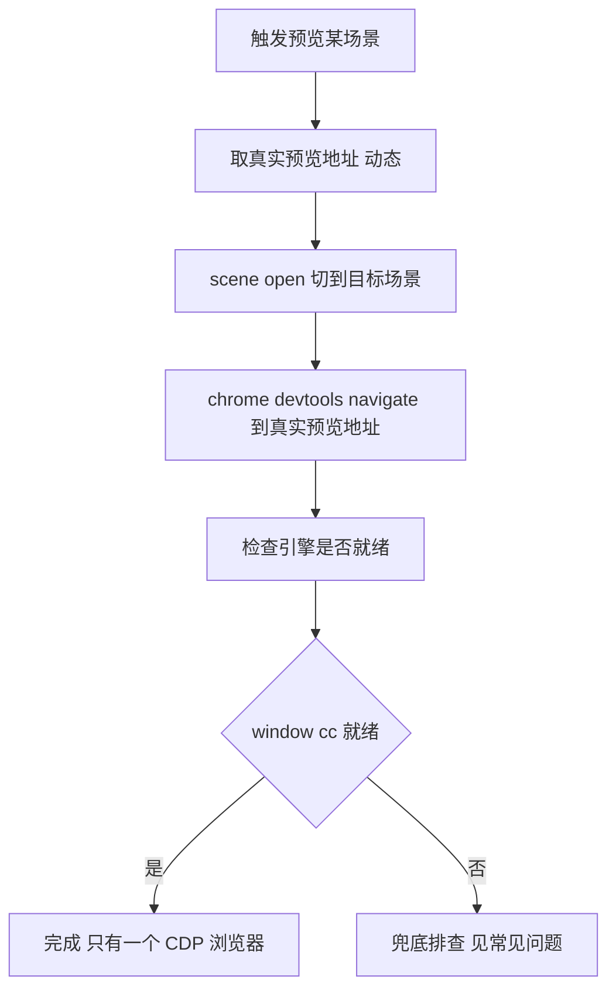

# Cocos 场景预览（单 CDP 浏览器，预览地址动态获取）

目标：预览指定场景，全程只启动一个由 CDP 控制的专用 Chrome（chrome-devtools-mcp 拉起的那一个），不要 Cocos 编辑器弹出的系统浏览器。预览端口必须动态获取。

## 核心要点（必读）

1. **预览地址动态获取，绝不写死 7456**：多工程同时开时，Cocos 会把预览端口从 7456 自动递增（7457、7458 等），任何写死的端口都会失效。每次预览都先按步骤 1 取当前真实预览地址（cocos-mcp 返回的已规范成 localhost 形式），后续全部用它。
2. **MCP server 启动时已后台拉起预览**：cocos-mcp 扩展启动时会查询并缓存真实预览地址（多工程时拿到的就是本工程端口）。所以正常情况下 server_information 能直接返回 previewUrl。
3. **拿地址的两条路都不弹系统浏览器**：server_information（纯查询）或 project run 传 openBrowser=false，二者都不弹系统浏览器，CDP 专用 Chrome 始终是唯一窗口。
4. **切场景用 scene_management(open)**：在编辑器把当前场景切到目标场景（不弹任何浏览器）。预览页加载的就是编辑器当前场景。
5. **唯一浏览器窗口靠 chrome-devtools navigate**：CDP 专用 Chrome navigate 到步骤 1 取到的真实预览地址。
6. **localhost 不用真实局域网 IP**：cocos-mcp 返回的地址已是 localhost，不用 query 出来的局域网 IP（换环境失效）。
7. **不重复开**：先 list_pages 看是否已有页面在该预览地址，有则复用。

## 流程图



## 触发条件

当用户说类似下面的话时使用本 skill：

- 预览 sss 场景 / 运行场景 / 启动预览
- 在浏览器里打开场景 / 在可调试浏览器打开预览
- preview xxx.scene
- 跑一下场景看看效果
- 帮我启动 xxx 场景 preview
- 只启动一个 CDP 浏览器 / 别弹系统浏览器

## 关键工具

| 工具 | 作用 |
|------|------|
| `server_server_information`（cocos） | action=get_comprehensive_status，返回的 previewUrl 是当前真实预览地址（首选，纯查询无副作用） |
| `project_project_manage`（cocos） | action=run, platform=browser, openBrowser=false，返回 data.url 为真实预览地址（previewUrl 为空时兜底） |
| `scene_scene_management`（cocos） | get_list 查场景；open 切到目标场景（不弹窗） |
| `list_pages`（chrome-devtools） | 列出专用 Chrome 标签页（含 pageId、url） |
| `select_page`（chrome-devtools） | 按 pageId 切到目标页 |
| `navigate_page`（chrome-devtools） | navigate 到真实预览地址（type=url）—— 唯一窗口 |
| `evaluate_script`（chrome-devtools） | 跑 JS，验证 window.cc 是否就绪 |

## 操作步骤

### 1. 取真实预览地址（动态，不要假设 7456）

优先调 `mcp__cocos-creator__server_server_information`，action=`get_comprehensive_status`，从返回的 `previewUrl` 字段取预览地址，记为「预览地址」（形如 http://localhost:7456，或多工程时的 7457）。

若 `previewUrl` 为空（MCP server 刚启动、预览尚未就绪），改调 `mcp__cocos-creator__project_project_manage`：action=`run`，platform=`browser`，openBrowser=`false`，从返回的 `data.url` 取预览地址。openBrowser=false 不会弹系统浏览器。

把取到的「预览地址」记住，后续 navigate、判断已有页面、eval 全部用它，绝不回退到写死的 7456。

### 2. 确认场景存在与路径

调用 `mcp__cocos-creator__scene_scene_management`，action=`get_list`，确认目标场景名及其 `db://assets/scenes/<场景名>.scene` 路径。不要凭猜测填 scenePath。

### 3. 在编辑器切到目标场景（不弹窗）

调用 `mcp__cocos-creator__scene_scene_management`：action=`open`，scenePath=`db://assets/scenes/<场景名>.scene`。这一步把编辑器当前场景切到目标场景，预览页随之加载该场景。不弹任何浏览器。

### 4. 在 CDP 专用 Chrome 打开预览页（唯一窗口）

调用 `mcp__chrome-devtools__list_pages`：

- 若返回里有页面且 url 含「预览地址」的端口 → 记下 pageId，select_page 复用，跳到验证。
- 若没有 → 调用 navigate_page（type=url，url=步骤 1 取到的预览地址）打开预览页。

然后调用 evaluate_script 跑：

```js
() => typeof window.cc
```

- 返回 "object" → 引擎就绪，进入步骤 5。
- 返回 "undefined" → 见「常见问题」排查。

### 5. 回报结果

告诉用户：

- 预览地址：步骤 1 取到的真实地址
- 预览已在 CDP 专用 Chrome 打开、引擎就绪（window.cc = object）
- 全程未弹系统浏览器，只有这一个浏览器窗口
- 可直接用 cocos-browser-logs 读日志（同一 Chrome 实例）

## 完整示例

用户：帮我启动 sss.scene 场景 preview

执行：

1. `server_server_information`(get_comprehensive_status) → previewUrl = http://localhost:7457（本例为多工程端口递增后的真实地址）。
2. `scene_scene_management` get_list → 确认 sss.scene，路径 db://assets/scenes/sss.scene。
3. `scene_scene_management` open（scenePath=db://assets/scenes/sss.scene）→ 编辑器切到 sss（不弹窗）。
4. `list_pages` → 没有页面在该预览地址 → `navigate_page`(url=http://localhost:7457) → `evaluate_script`(() => typeof window.cc) → "object"。
5. 回报：预览已在 CDP 专用 Chrome 就绪，访问 http://localhost:7457，未弹系统浏览器，可直接读日志。

## 常见问题

- **navigate 失败 / 连不上预览地址**：预览服务没跑或地址过期。重做步骤 1（先 server_information，空则 run openBrowser=false）取最新地址；若 run 也回退到默认 7456 仍连不上，确认 Cocos Creator 已打开项目且扩展已加载。
- **取到的预览地址不对（端口变了）**：多工程切换或重开编辑器会导致端口变化。每次预览都重新执行步骤 1，不要复用上次的地址。
- **window.cc 为 undefined**：先确认编辑器开着、cocos-mcp-server 扩展已加载、编辑器在前台；若控制台刷 cce:/internal CORS 错，是 temp/programming 编译产物损坏（关编辑器删 temp/programming 重开重编译），不是协议不兼容。
- **出现两个浏览器窗口**：说明误用了不带 openBrowser=false 的 run（或 run 因 schema 缓存退回默认 openBrowser=true 弹了系统浏览器）。关掉系统浏览器窗口即可，CDP 窗口不受影响；建议重启 Claude Code 会话刷新 MCP schema，让 openBrowser=false 稳定生效。
- **预览的不是目标场景**：确认步骤 3 的 open 已切到目标场景；navigate_page 会重新加载当前编辑器场景。
- **chrome-devtools 工具不可用**：.mcp.json 改动后需重启 Claude Code 会话才加载 chrome-devtools-mcp。

## 相关约定

- 与 cocos-browser-logs、cocos-browser-eval 衔接：三份 skill 共用步骤 1 取到的真实预览地址，任一份先取到，另两份可直接复用（同一预览服务）。
- 预览服务由编辑器常驻，cocos-mcp 启动时已确认在跑并缓存地址；无需手动点预览按钮。
- 改 cocos-mcp-server 源码后必须重启编辑器，刷新扩展无效（见项目记忆 cocos-mcp-server-rebuild-restart）。
- 依赖 cocos-mcp（已配）与 chrome-devtools-mcp（.mcp.json 已配）。
