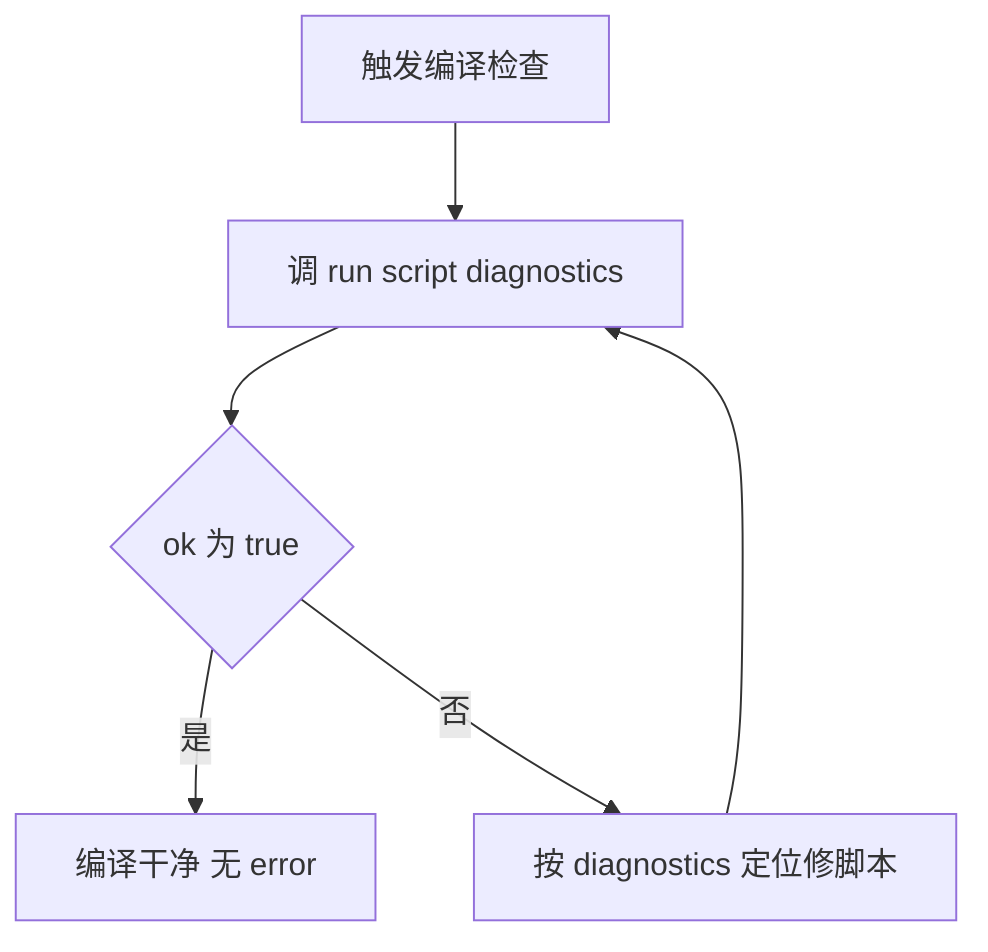

# Cocos 脚本编译检查（run_script_diagnostics）

调用 run_script_diagnostics 工具检查项目的 TypeScript 编译错误，拿到精准报错列表（file/line/column/code/message），修完再查直到干净。

## 核心要点（必读）

1. **工具**：`run_script_diagnostics`（debug category）。用 CocosCreator 编辑器**内置 typescript** 跑 `tsc --noEmit --skipLibCheck`——版本和编辑器完全匹配，不会出"typescript 版本不兼容 / cc 声明缺失"等坑。
2. **只报用户代码 error**：`--skipLibCheck` 跳过所有 `.d.ts`（cc.d.ts / jsb.d.ts 等引擎声明），parseTscOutput 再过滤 `node_modules` / `extensions` 路径——返回的全是 `assets/` 下用户 `.ts` 脚本的真实 error，没有引擎声明噪音。
3. **输入极简**：不用传 tsconfigPath（自动找项目根 `tsconfig.json` 或 `temp/tsconfig.cocos.json`）。
4. **修复循环**：查 → 按 diagnostics 修 → 重查 → 直到 `ok=true`。

## 流程图



## 触发条件

- 编译检查 / 脚本报错 / TS error / 编译错误
- 检查代码 / 跑一下 tsc / verify 编译
- 有没有编译问题 / 查报错
- 改完脚本想确认没引入错误

## 关键工具

| 工具 | 作用 |
|------|------|
| `run_script_diagnostics`（cocos，debug category） | 跑 tsc 编译检查，返回 diagnostics 列表 |

> MCP 协议工具名：`debug_run_script_diagnostics`。
> HTTP 端点（curl / 外部调用）：`POST http://127.0.0.1:{port}/api/debug/run_script_diagnostics`，body 留空 `{}` 即可。

## 返回结构

```json
{
  "success": true,
  "tool": "debug_run_script_diagnostics",
  "result": {
    "success": false,
    "message": "Found 1 TypeScript error(s).",
    "data": {
      "ok": false,
      "exitCode": 2,
      "summary": "Found 1 TypeScript error(s).",
      "compiler": ".../resources/app.asar.unpacked/node_modules/typescript/bin/tsc",
      "tsconfigPath": ".../tsconfig.json",
      "diagnostics": [
        { "file": "assets/TestScript.ts", "line": 7, "column": 22, "code": "TS1180", "message": "Property destructuring pattern expected." }
      ]
    }
  }
}
```

关键字段：
- `result.data.ok`：`true` = 无 error；`false` = 有 error
- `result.data.diagnostics`：报错列表，每项 `{ file, line, column, code, message }`
- `result.data.summary`：一句话摘要
- 顶层 `success` / `result.success`：true=调用成功 / 诊断结果（ok）

## 操作步骤

### 1. 调 run_script_diagnostics 查报错

调用 `run_script_diagnostics`（无需参数）。看 `result.data.diagnostics`。

### 2. 有 error → 逐个修

按 diagnostics 的 `file` / `line` / `column` 定位，`message` + `code` 是原因（如 TS1180 = 解构语法错）。修 `assets/` 下的 `.ts` 脚本。

### 3. 重调直到 ok=true

修完再调 `run_script_diagnostics`，直到 `result.data.ok=true` 或 `diagnostics=[]`。

### 4. 回报

- `ok=true` → 编译干净，无 error
- 还有 error → 列出剩余 diagnostics，继续修

## 完整示例

用户：检查下脚本有没有编译错误

执行：
1. `run_script_diagnostics` → `result.data.dagnostics` = `[{file:"assets/Foo.ts", line:12, column:5, code:"TS2322", message:"Type 'string' is not assignable to type 'number'."}]`
2. 修 `assets/Foo.ts` 第 12 行的类型问题
3. 再调 `run_script_diagnostics` → `ok=true`, `diagnostics=[]`
4. 回报：编译干净，Foo.ts(12) 的类型错误已修。

## curl 示例（端口以面板为准，默认 3001）

```bash
curl -X POST http://127.0.0.1:3001/api/debug/run_script_diagnostics \
  -H "Content-Type: application/json" \
  -d '{}'
```

成功响应（有 error）：HTTP 200，body 即上面的返回结构。
失败响应（server 没起 / 端口错）：HTTP 连接失败。

## 常见 error code（TSxxxx，仅分类用，以 message 为准）

- TS1180：Property destructuring pattern expected（解构语法错）
- TS2322：Type 'X' is not assignable to type 'Y'（类型不匹配）
- TS2304：Cannot find name 'X'（变量/类型未定义）
- TS1005：',' expected（语法缺符号）
- TS2748：Cannot access ambient const enums（引擎声明相关，正常会被 skipLibCheck 跳过；若出现说明 skipLibCheck 没生效）

## 注意事项

- **不用装 typescript**：工具用编辑器内置 typescript（CocosCreator 自带），项目 `node_modules` 没 typescript 也能查。
- **引擎声明不报**：`--skipLibCheck` 跳过 cc.d.ts / jsb.d.ts 等引擎 `.d.ts`（它们的类型问题由编辑器自己管，不算用户代码错误）。
- **extensions / node_modules 不报**：parseTscOutput 过滤了副本扩展/依赖的噪音，只留 `assets/` 下用户脚本。若项目 tsconfig 扫到了 extensions，建议在 `tsconfig.json` 加 `"exclude": ["extensions"]`。
- **端口以面板为准**：默认 3001，可在面板服务器设置改。
- 改 cocos-mcp-server 源码后需重启编辑器（刷新扩展无效）。

## 相关约定

- 编译检查后修脚本，可配合 `cocos-scene` / `cocos-node` / `cocos-component` 等 skill 操作场景。
- 改源码后必须重启编辑器（项目记忆 cocos-mcp-server-rebuild-restart）。
- 依赖 cocos-mcp（已配）。
