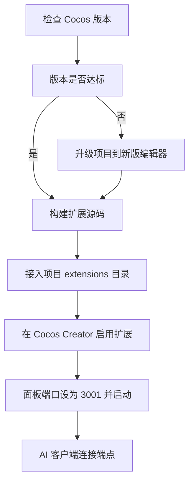

# CocosMCP 项目集成 MCP 指南

> 把 cocos-mcp-server（Cocos Creator 编辑器扩展 + MCP 服务器）接入 CocosMCP 项目，
> 让 AI 客户端（Claude Code / Cursor 等）通过 HTTP 协议直接操控 Cocos Creator 编辑器。

## 一句话理解（类比）

把整套机制想象成"AI 遥控 Cocos 编辑器"：

| 角色 | 在本项目中 | 类比 |
|---|---|---|
| AI 客户端 | Claude Code / Cursor | 拿遥控器的人 |
| MCP 服务器 | cocos-mcp-server 扩展（运行在编辑器内） | 遥控器 / 翻译官 |
| HTTP 端点 | http://127.0.0.1:3001/mcp | 遥控信号频率 |
| Cocos Creator | 被操控的编辑器 | 被遥控的电视 |

AI 不直接碰编辑器代码，而是把标准化 MCP 指令发到 HTTP 端点，扩展在编辑器内翻译成场景、节点、组件的实际操作。

## 架构与数据流


扩展自身的分层（详见仓库根 CLAUDE.md）：
main.ts 主进程 -> mcp-server.ts HTTP 服务 -> tools 工具类 -> Editor.Message -> scene.ts 场景脚本

## 前置检查（两个必须先解决的阻塞）

### 阻塞 1：Cocos Creator 版本不达标

- 扩展要求 Cocos Creator 3.8.6 或更高（见 cocos-mcp-server/README.md 系统要求）
- 当前 CocosMCP 项目是 3.7.3（见 CocosMCP/package.json）
- 3.7.3 低于 3.8.6，直接加载扩展会不兼容

解决：先把项目升级到 3.8.6 以上（见下方步骤 1）。

### 阻塞 2：默认端口 3000 与本地 Gitea 冲突

- MCP 服务器默认端口是 3000
- 本地 Gitea 已经占用 3000（远程仓库地址 http://127.0.0.1:3000/mickorz/CocosMCP.git）
- 二者同端口会导致 MCP 启动失败

解决：在扩展面板把 MCP 端口改成 3001（或其它空闲端口），AI 客户端配置也用 3001。

## 集成流程



### 步骤 1：升级项目到 Cocos Creator 3.8.6+

1. 通过 Cocos Dashboard 安装 Cocos Creator 3.8.6 或更高版本
2. 在 Dashboard 里用新版编辑器打开 CocosMCP 项目
3. 编辑器会提示迁移项目格式，按提示完成升级
4. 升级后 CocosMCP/package.json 的 creator.version 会变为 3.8.x

说明：项目升级是格式迁移，建议先 git 提交当前状态作为备份。

### 步骤 2：构建扩展

submodule 当前在仓库根（不在 extensions 内），在仓库根构建：

```bash
cd cocos-mcp-server
npm install
npm run build
```

产物输出到 dist/，Cocos Creator 加载的是 dist/main.js。改了 source/ 必须重新 build。

### 步骤 3：把扩展接入项目的 extensions 目录

cocos-mcp-server 是 submodule 且位于仓库根，用目录 junction 把它接进项目扩展目录（同一份文件，git 关系不变）。

cmd：
```cmd
mkdir "E:\CocosProjects\CocosMCP\CocosMCP\extensions"
mklink /J "E:\CocosProjects\CocosMCP\CocosMCP\extensions\cocos-mcp-server" "E:\CocosProjects\CocosMCP\cocos-mcp-server"
```

PowerShell：
```powershell
New-Item -ItemType Directory -Force "E:\CocosProjects\CocosMCP\CocosMCP\extensions"
New-Item -ItemType Junction -Path "E:\CocosProjects\CocosMCP\CocosMCP\extensions\cocos-mcp-server" -Target "E:\CocosProjects\CocosMCP\cocos-mcp-server"
```

接好后的结构：
```
CocosMCP/
  extensions/
    cocos-mcp-server/   -> junction 指向仓库根的 submodule
      source/ dist/ package.json ...
```

备选方案：不建 junction，直接在 Cocos Creator 扩展管理器里加载本地扩展，指向仓库根的 cocos-mcp-server 路径（作为全局扩展）。项目级 extensions/ 更符合随项目走的惯例。

### 步骤 4：在 Cocos Creator 启用扩展

1. 用 Cocos Creator 打开 CocosMCP 项目
2. 菜单 扩展 > 扩展管理器，确认 cocos-mcp-server 已启用（首次需刷新或重启编辑器）
3. 菜单出现 扩展 > Cocos MCP Server

注意（首次安装可跳过）：若之前装过旧版，先删除 CocosMCP/settings/ 下的 mcp-server.json 和 tool-manager.json，再重开面板（README 安装前必读要求）。

### 步骤 5：启动 MCP 服务器

1. 扩展 > Cocos MCP Server 打开面板
2. 端口改为 3001（避开 Gitea 的 3000）
3. 可选：勾选 自动启动、调试日志
4. 点击 启动服务器

端点变为 http://127.0.0.1:3001/mcp

### 步骤 6：配置 AI 客户端连接

Claude Code CLI（当前在用）：
```bash
claude mcp add --transport http cocos-creator http://127.0.0.1:3001/mcp
```

Claude 客户端（配置文件）：
```json
{
  "mcpServers": {
    "cocos-creator": {
      "type": "http",
      "url": "http://127.0.0.1:3001/mcp"
    }
  }
}
```

Cursor / VS 类：
```json
{
  "mcpServers": {
    "cocos-creator": { "url": "http://localhost:3001/mcp" }
  }
}
```

## 验证集成成功

1. 在 AI 客户端列出 MCP 工具，应能看到 cocos-creator 提供的工具（如 scene_management、node_query 等）
2. 让 AI 执行一个只读操作，例如 查询当前场景的节点层级，若返回场景结构即成功
3. Cocos Creator 面板能看到连接状态

## 常见问题

| 现象 | 原因 / 处理 |
|---|---|
| 扩展加载失败或菜单不出现 | Cocos 版本低于 3.8.6，或未 build（dist/ 缺失），重新 npm run build |
| 启动服务器报端口占用 | 3000 被 Gitea 占用，改成 3001 等空闲端口 |
| 工具列表显示异常 | 删除 CocosMCP/settings/mcp-server.json 与 tool-manager.json 后重开面板 |
| AI 连接超时 | 确认编辑器已启动服务器、端口一致、防火墙未拦本地端口 |
| junction 创建失败 | 用 cmd 的 mklink 或开启开发者模式；或改用扩展管理器加载路径 |

## 引用说明

- 本项目 submodule 文档：cocos-mcp-server/README.md（开源版 v1.5.4 安装与使用说明）
- 上游仓库：https://github.com/mickorz/cocos-mcp-server
- Model Context Protocol 协议官网：https://modelcontextprotocol.io
- Cocos Creator 扩展开发手册：https://docs.cocos.com/creator/manual/zh/editor/extension/
- Claude Code 的 MCP 配置：https://docs.claude.com/en/docs/claude-code/mcp
