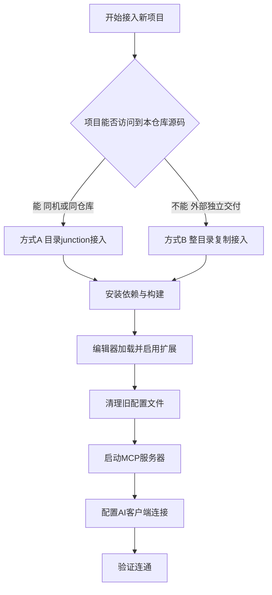

# cocos-mcp-server 新项目配置指南

> 适用对象：想给一个**全新的 Cocos Creator 项目**接入 `cocos-mcp-server` 扩展，让 AI 客户端（Claude / Cursor 等）通过 MCP 协议远程操控编辑器。
>
> 本文档基于本仓库已验证的实际状态编写：扩展版本 `v1.5.4`，`editor` 字段 `>=3.7.3`，MCP 默认端口 `3001`。

---

## 一、它能做什么（一句话）

让 AI 客户端通过 HTTP 标准协议，远程调用 Cocos Creator 编辑器的 50 个工具（建场景、加节点、挂组件、做预制体、查资源、跑构建……），相当于给 AI 配了一个"编辑器遥控器"。

整体数据流：


---

## 二、类比理解：把它当成"外卖平台"

| 角色 | 外卖平台类比 | 本项目对应 | 说明 |
|------|--------------|------------|------|
| AI 客户端 | 顾客 | Claude / Cursor | 提需求、下单 |
| MCP 协议 | 外卖订单协议 | HTTP + JSON-RPC | 标准化的下单格式，谁都能接 |
| MCP 服务器 | 餐厅接单台 | `MCPServer`（扩展主进程） | 接单、分发给后厨 |
| 工具类 | 菜单上的菜 | 50 个工具（scene / node / prefab...） | 每个工具是一道可点的"菜" |
| 场景脚本 | 后厨 | `scene.ts`（场景进程） | 真正动手改场景的地方 |
| Cocos 场景 | 做出来的菜 | 项目里的节点树 | 最终产物 |

关键点：**节点与组件的真实增删改只能在"后厨"（场景进程）执行**。AI 不能直接摸场景，必须通过"接单台 -> 后厨"这条链路。

---

## 三、前置要求

| 项 | 要求 | 备注 |
|----|------|------|
| Cocos Creator | `>=3.7.3` | 本仓库已把扩展 `editor` 字段从上游的 `3.8.6` 调到 `3.7.3`。若直接用上游原版，仍需 `3.8.6+` |
| Node.js | Cocos Creator 自带即可 | 能在命令行跑 `npm` 即可，无需单独安装 |
| 扩展源码 | 一份 `cocos-mcp-server` | 本仓库根目录的 `cocos-mcp-server/` 就是 |

---

## 四、先选接入方式



两种方式对比：

| 维度 | 方式 A：目录 junction | 方式 B：整目录复制 |
|------|----------------------|-------------------|
| 适用 | 项目在本仓库内 / 能访问到本机源码 | 项目在外部、需独立交付 |
| 源码份数 | 单一来源（共享一份源码） | 每个项目各一份副本 |
| 改源码后 | 重新 build + 刷新扩展即生效 | 要重新复制 + build + 刷新 |
| 推荐度 | 同机开发首选 | 跨机器交付必选 |

> 名词解释：**junction** 是 Windows 的"目录链接"，让 `新项目/extensions/cocos-mcp-server` 这个路径指向本仓库真正的源码目录，访问它等于访问源码本体，不占额外空间。类似 Linux 的软链接（symlink）。

---

## 五、方式 A：目录 junction 接入（同机开发首选）

假设：
- 本仓库源码在 `E:\CocosProjects\CocosMCP\cocos-mcp-server`
- 新项目路径 `<新项目>`（例如 `E:\CocosProjects\MyNewGame`）

### 步骤 A1：创建 junction

PowerShell 执行：

```powershell
$src = "E:\CocosProjects\CocosMCP\cocos-mcp-server"
$dst = "<新项目>\extensions\cocos-mcp-server"

# 确保 extensions 目录存在
New-Item -ItemType Directory -Force "<新项目>\extensions" | Out-Null

# 如果目标已存在先删掉（避免重复建报错）
if (Test-Path $dst) { Remove-Item $dst -Recurse -Force }

# 建立 junction
New-Item -ItemType Junction -Path $dst -Target $src | Out-Null

# 验证
Get-Item $dst | Select-Object FullName, LinkType, Target
```

### 步骤 A2：安装依赖并构建

```powershell
cd $src            # 进入真正的源码目录（junction 也行，但直接进源码更稳）
npm install        # 触发 preinstall：联网校验 @cocos/creator-types 版本
npm run build      # tsc 编译 source/ -> dist/
```

构建成功后 `dist/main.js` 存在即可（编辑器实际加载的就是它）。

---

## 六、方式 B：整目录复制接入（外部独立项目）

### 步骤 B1：复制扩展到新项目

PowerShell 执行：

```powershell
$src = "E:\CocosProjects\CocosMCP\cocos-mcp-server"
$dst = "<新项目>\extensions\cocos-mcp-server"

New-Item -ItemType Directory -Force "<新项目>\extensions" | Out-Null

# 复制源码（排除 node_modules 和 dist，到目标侧重新生成，避免平台/路径问题）
robocopy $src $dst /E /XD node_modules dist /XF *.log
```

> 说明：`robocopy` 的 `/E` 递归复制含空目录，`/XD` 排除 `node_modules` 与 `dist`，`/XF` 排除日志。复制后目标侧需要重新 `install + build`。

### 步骤 B2：安装依赖并构建

```powershell
cd $dst
npm install
npm run build
```

> 注意：复制方式下，**每次源码更新都要重新复制 + build**，否则新项目用的还是旧副本。

---

## 七、在编辑器里加载并启用扩展

1. 用 Cocos Creator 打开新项目目录。
2. 菜单 `扩展 -> 扩展管理器 -> 项目`，找到 `cocos-mcp-server`：
   - 若未出现：点"刷新"，或重启编辑器（junction / 复制都应被自动识别）。
   - 确保开关为**启用**状态。
3. 菜单 `扩展 -> Cocos MCP Server` 打开控制面板。

---

## 八、清理旧配置（重要，首次安装前必做）

README 明确要求：首次安装或升级前，删除项目 `settings/` 下的两个文件，否则工具列表会异常：

```powershell
Remove-Item "<新项目>\settings\mcp-server.json" -Force -ErrorAction SilentlyContinue
Remove-Item "<新项目>\settings\tool-manager.json" -Force -ErrorAction SilentlyContinue
```

> 这两个文件不存在也没关系（`-ErrorAction SilentlyContinue` 会静默跳过）。删完后重新打开面板即恢复正常。

---

## 九、启动 MCP 服务器

在 `扩展 -> Cocos MCP Server` 面板里：

- **端口**：默认 `3001`（本仓库版本；上游原版默认 `3000`，以面板实际显示为准）
- **自动启动**：可勾选，编辑器启动即起服务
- **调试日志**：开发排错时可开
- 点 **启动服务器**

启动成功后，服务暴露在 `http://127.0.0.1:3001/mcp`（端口以面板为准）。

---

## 十、配置 AI 客户端（端口以面板为准，下文以 3001 为例）

### 10.1 Claude Code（CLI）—— 推荐使用 project 作用域

Claude Code 的 MCP 有三种作用域，**默认不加 `--scope` 时是 `local`**（很容易被误当成"全局"）：

| 作用域 | 命令标志 | 配置存放位置 | 谁能使用 | 是否进 git |
|--------|---------|-------------|----------|-----------|
| local（默认） | 无 或 `--scope local` | `~/.claude.json` 的 `projects.<路径>` | 仅本人、仅在该项目目录下 | 否 |
| **project（推荐）** | `--scope project` | 项目根的 `.mcp.json` | 任何打开该项目的人 | 是 |
| user（全局） | `--scope user` | `~/.claude.json` 顶层 | 本人的所有项目 | 否 |

> 易误解点：`local` 的配置虽然写在全局文件 `~/.claude.json` 里，但被**项目路径隔离**，只在该项目（及其子目录）启动 Claude Code 时才加载，不会影响其他项目。真正意义上的"全局"是 `user`。

给"当前 Cocos 项目"配置，**推荐用 `project` 作用域**——配置跟着项目走、可提交 git、团队 clone 下来即可用。在 Claude Code 识别的项目根（通常是含 `.git` 的目录；本仓库即仓库根 `E:\CocosProjects\CocosMCP`）下执行：

```powershell
# 1) 若之前用默认 local 加过，先移除（local 绑在该 project 上，需在项目根执行）
claude mcp remove cocos-creator

# 2) 以 project 作用域重新添加，会在项目根生成 .mcp.json
claude mcp add --transport http --scope project cocos-creator http://127.0.0.1:3001/mcp
```

执行后项目根生成的 `.mcp.json`：

```json
{
  "mcpServers": {
    "cocos-creator": {
      "type": "http",
      "url": "http://127.0.0.1:3001/mcp"
    }
  }
}
```

注意事项：

- **首次信任询问**：首次加载该项目的 MCP，Claude Code 会询问是否信任，确认即可。
- **进 git 与否**：`.mcp.json` 默认会被 git 跟踪；若不想提交，在根 `.gitignore` 加一行 `.mcp.json`。
- **会话重载**：添加后当前已开的会话不会自动连上，在 Claude Code 里输入 `/mcp` 查看连接状态，必要时**重启会话**让它加载。
- **查看 / 移除**：`claude mcp list` 查看已配置项；`claude mcp remove cocos-creator` 移除。

### 10.2 Claude Desktop 客户端（配置文件）

```json
{
  "mcpServers": {
    "cocos-creator": {
      "type": "http",
      "url": "http://127.0.0.1:3001/mcp"
    }
  }
}
```

### 10.3 Cursor / VS 类

```json
{
  "mcpServers": {
    "cocos-creator": { "url": "http://localhost:3001/mcp" }
  }
}
```

### 10.4 OpenCode

opencode 与前面几个客户端有两点关键不同：

- HTTP 类型的 MCP 用 **`"type": "remote"`**（注意不是 `"http"`），走 Streamable HTTP transport。
- **没有 `mcp add` 命令**，配置靠直接编辑配置文件。

配置文件位置：

- **项目级**：项目根的 `opencode.json`（或 `opencode.jsonc`）。opencode 会从当前目录向上查找，直到最近的 Git 目录。
- **全局**：`~/.config/opencode/opencode.json`（Windows 上即 `C:\Users\<你的用户名>\.config\opencode\opencode.json`）。

给"当前 Cocos 项目"配置，在项目根新建 `opencode.json`：

```json
{
  "$schema": "https://opencode.ai/config.json",
  "mcp": {
    "cocos-creator": {
      "type": "remote",
      "url": "http://127.0.0.1:3001/mcp",
      "enabled": true,
      "timeout": 60000
    }
  }
}
```

字段说明：

- `type`：`remote` 表示远程 HTTP MCP（Streamable HTTP）。
- `url`：本地服务地址，端口以面板实际显示为准。
- `timeout`：拉取工具列表 / 调用工具的超时，单位毫秒，**默认 5000（5 秒）**。本地服务通常够快，但场景构建、资源查询等耗时操作建议调大（如 `60000`），避免超时。
- `enabled`：可省略，默认启用。

常用 CLI（在项目根执行）：

- `opencode mcp list` —— 列出所有 MCP 及其连接 / 鉴权状态。
- `opencode mcp debug cocos-creator` —— 调试该 MCP 的连接，连不上时首选。

注意事项：

- 配置文件可提交 git 跟项目走（同 `.mcp.json`），团队 clone 即可用。
- 改完配置需**重启 opencode 会话**才会重新加载。

---

## 十一、验证是否接入成功

1. 编辑器面板显示"服务器运行中"。
2. 在 AI 客户端让其调用一个只读工具，例如 `server_info` 或 `scene_management`（获取当前场景）。能正常返回 JSON 即连通成功。
3. 若失败：先看端口是否对得上、防火墙是否放行、`settings/mcp-server.json` 是否写入了正确端口。

---

## 十二、故障排查

| 现象 | 排查方向 |
|------|----------|
| 扩展管理器里找不到扩展 | 确认 `extensions/cocos-mcp-server/dist/main.js` 存在（已 build）；junction 是否建对目标；重启编辑器 |
| 扩展加载报版本错误 | 用上游原版时需 Cocos Creator `3.8.6+`；本仓库版本已降至 `3.7.3`。检查 `package.json` 的 `editor` 字段 |
| 工具列表异常 / 缺失 | 删除 `settings/mcp-server.json` 与 `tool-manager.json` 后重开面板 |
| 服务器起不来 | 端口被占用（换端口）、防火墙、Node 环境异常 |
| AI 客户端连不上 | URL 端口与面板一致；服务器已启动；本机回环 `127.0.0.1` 可达 |
| 改了源码没生效 | 编辑器加载的是 `dist/main.js`，必须重新 `npm run build` 再刷新扩展 |

---

## 十三、后续维护要点

- **改源码必 build**：编辑器加载 `dist/main.js`，不读 `source/`。改完源码后 `npm run build`，再到编辑器刷新扩展。
- **junction 方式的优势**：源码单一来源，build 一次，所有接入了该 junction 的项目刷新即生效。
- **升级扩展**：先删 `settings/mcp-server.json` 与 `tool-manager.json`，再替换源码 / 更新 submodule，重新 build。
- **不要把生成物提交**：`library/ temp/ build/ profiles/ local/ node_modules/` 都是 Cocos 标准忽略项；扩展的 `dist/` 是否提交看团队约定（本仓库 submodule 内 `dist/` 已跟踪）。

---

## 十四、引用说明

本文档内容参考与综合自以下资料：

- 本仓库扩展自带说明：`cocos-mcp-server/README.md`（安装步骤、工具体系、AI 客户端配置原文）
- 本仓库项目指引：`CLAUDE.md`（仓库结构、扩展接入约定、junction 与复制两种方式的约定）
- 上游开源仓库：https://github.com/mickorz/cocos-mcp-server （开源版 v1.5.4，50 个工具）
- MCP 协议官方规范：https://modelcontextprotocol.io （Model Context Protocol 标准化协议说明）
- Cocos Creator 扩展开发文档：https://docs.cocos.com/creator/manual/zh/editor/extension/ （扩展加载、`package.json` 字段、`contributions` 机制）
- OpenCode MCP 配置文档：https://opencode.ai/docs/mcp-servers/ （`type: "remote"` 的 Streamable HTTP 配置、字段说明）
- OpenCode 配置文件位置文档：https://opencode.ai/docs/config/ （项目级 / 全局 / Windows 配置文件查找顺序）
