# Cocos MCP Server 完整架构分析

> 本文聚焦 `cocos-mcp-server` v1.5.4 开源版的**架构维度**,用 Mermaid 图描述分层、进程、通信、协议、工具系统、回退策略、配置、生命周期与容错设计。工具清单详见同目录《cocos-mcp-server源码分析.md》。

---

## 一、架构总览

### 1.1 分层架构

整个系统分四层,自上而下逐层代理,每一层只与相邻层通信:

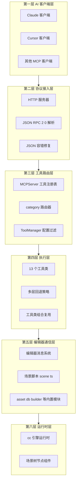

### 1.2 关键设计原则

| 原则 | 体现 |
|------|------|
| 单一职责分层 | 接入 / 路由 / 执行 / 通信四层分离,每层不越界 |
| 操作码统一 | 所有工具用 category toolName 加 action 参数,降低 AI 调用复杂度 |
| 多层回退兜底 | 每个 Editor Message 调用都有备用方案,失败级联到场景脚本 |
| 验证闭环 | 操作后主动重查返回 verificationData,让 AI 自验证 |
| 配置可持久化 | 双 json 文件保存服务器与工具配置,5 套方案可切换 |
| 协议容错 | JSON 解析失败自动修复,允许 AI 生成不规范 JSON |
| 进程隔离 | 节点组件增删改只能场景进程执行,主进程只发消息 |

---

## 二、进程模型

### 2.1 三进程架构

Cocos Creator 扩展运行在三个独立进程,各自有不同权限与 API:

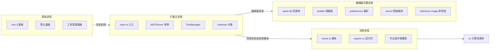

### 2.2 各进程职责与边界

| 进程 | 入口 | 能做 | 不能做 |
|------|------|------|------|
| 扩展主进程 | `dist/main.js` | 启动 HTTP 服务器、注册工具、响应编辑器消息、读写配置文件、用 fs os 本地操作 | 直接读写场景树、直接 require cc |
| 场景进程 | `dist/scene.js` | require cc 调运行时 API、节点组件增删改、场景层级查询 | 启动 HTTP 服务器、读写项目配置 |
| 面板进程 | `dist/panels/default` | Vue 3 渲染 UI、用户交互、通过消息调主进程方法 | 直接调场景进程、直接读写文件 |

> **关键边界**:节点与组件的真实增删改只能在场景进程执行。主进程的工具类通过 `Editor.Message.request('scene', ...)` 跨进程调用场景进程的能力。

---

## 三、IPC 通信架构

系统存在两条独立的 IPC 通道,分别服务不同方向:

### 3.1 通道一 面板到主进程

面板进程用 Cocos 扩展**消息机制**调用主进程 `methods` 对象中的方法。方法名在 `package.json` 的 `contributions.messages` 中声明:

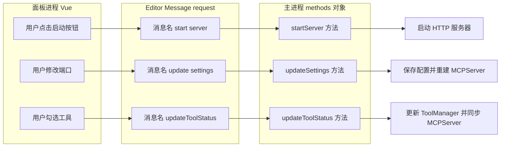

**面板调用的全部消息名**(来自 grep 结果):

| 面板场景 | 消息名 | 主进程方法 |
|------|------|------|
| 启动服务器 | `start-server` | `startServer` |
| 停止服务器 | `stop-server` | `stopServer` |
| 保存设置并重启 | `update-settings` | `updateSettings` |
| 查询状态 | `get-server-status` | `getServerStatus` |
| 获取工具管理状态 | `getToolManagerState` | `getToolManagerState` |
| 切换单个工具 | `updateToolStatus` | `updateToolStatus` |
| 批量切换工具 | `updateToolStatusBatch` | `updateToolStatusBatch` |
| 创建配置 | `createToolConfiguration` | `createToolConfiguration` |
| 更新配置 | `updateToolConfiguration` | `updateToolConfiguration` |
| 删除配置 | `deleteToolConfiguration` | `deleteToolConfiguration` |
| 切换当前配置 | `setCurrentToolConfiguration` | `setCurrentToolConfiguration` |
| 导出配置 | `exportToolConfiguration` | `exportToolConfiguration` |
| 导入配置 | `importToolConfiguration` | `importToolConfiguration` |

### 3.2 通道二 主进程到场景进程

工具类用 `Editor.Message.request('scene', <message>, ...)` 调用编辑器内置场景消息,或用 `execute-scene-script` 调用 `scene.ts` 中导出的方法:

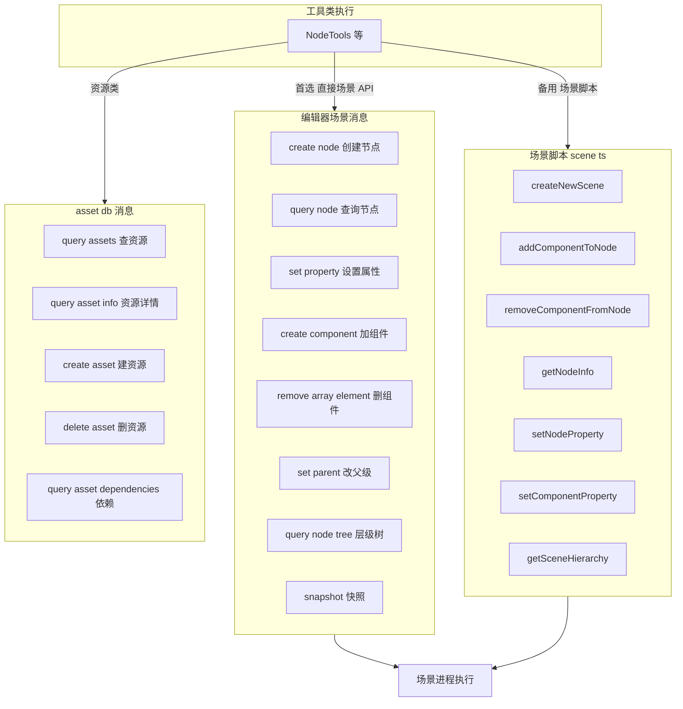

> **双层兜底**:工具类首选直接调编辑器场景消息(如 `scene/create-node`),失败时回退到 `scene/execute-scene-script` 调用 `scene.ts` 导出的方法。两条路径都到达场景进程,但接口形态不同。

---

## 四、MCP 协议架构

### 4.1 协议握手与分发

服务器实现 MCP 协议(基于 JSON-RPC 2.0,协议版本 2024-11-05):

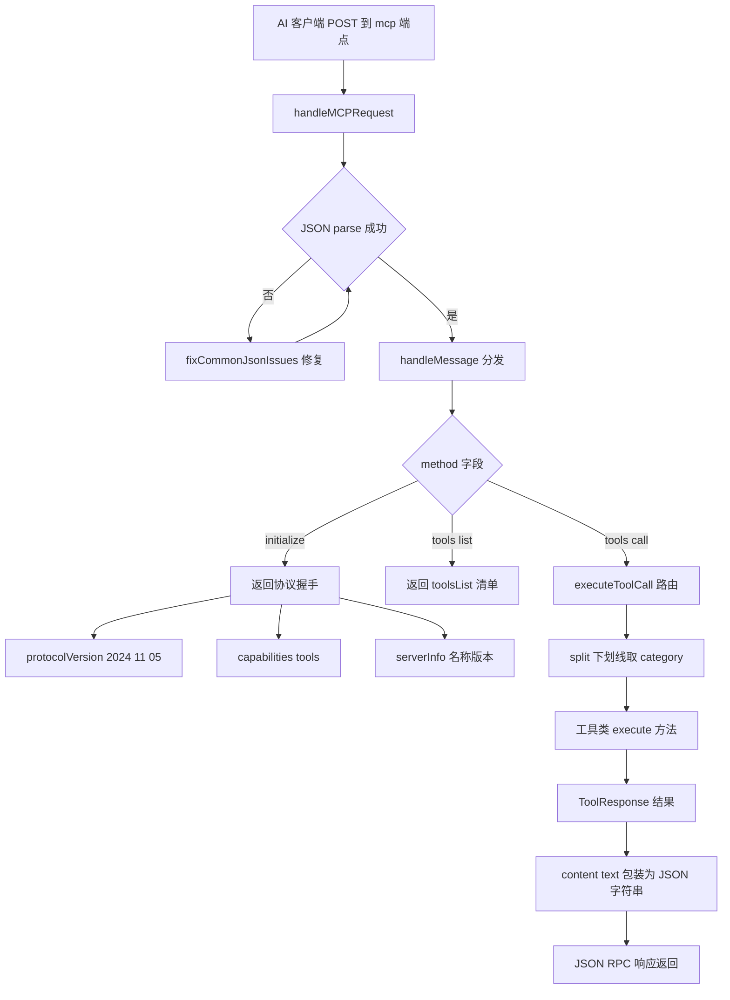

### 4.2 四类 HTTP 端点

| 方法 | 路径 | 分发逻辑 |
|------|------|------|
| POST | `/mcp` | `handleMCPRequest` → JSON-RPC 分发 initialize tools list tools call |
| GET | `/health` | 直接返回 status 与 tools 数量 |
| POST | `/api/{category}/{toolName}` | `handleSimpleAPIRequest` → 拼接后走 `executeToolCall` |
| GET | `/api/tools` | `getSimplifiedToolsList` 返回带 curl 示例的清单 |
| OPTIONS | * | CORS 预检,直接 200 |

> **简化 REST 接口** `/api/...` 是为非 MCP 客户端提供的便利接口,内部复用同一套 `executeToolCall` 路由,与 `/mcp` 走相同执行路径。

### 4.3 JSON 容错架构

AI 生成的 JSON 常见瑕疵与修复策略(`utils/json-utils.ts`):

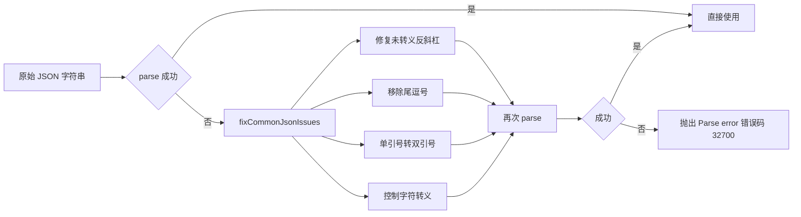

---

## 五、工具系统架构

### 5.1 工具注册与路由

工具的注册、过滤、路由三阶段:

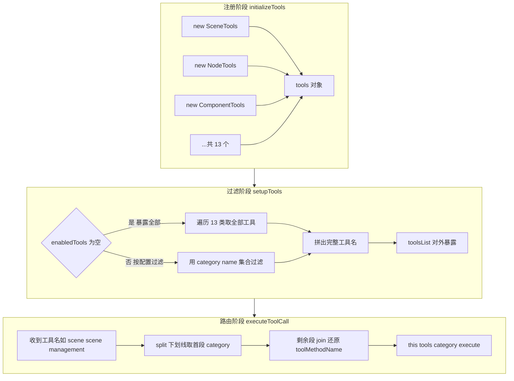

### 5.2 工具命名与路由机制

```
工具全名 = category + "_" + toolName
示例:   scene + "_" + scene_management  =>  scene_scene_management

路由切分:
  parts = toolName.split("_")
  category = parts[0]                        // "scene"
  toolMethodName = parts.slice(1).join("_")  // "scene_management"

执行:
  this.tools[category].execute(toolMethodName, args)
```

> 因为 `toolName` 自身含下划线(如 `scene_management`),路由时只切第一段作为 category,剩余用 `join('_')` 还原。这是 v1.5.4 命名设计的核心权衡。

### 5.3 工具类组合关系

工具类之间存在组合复用,避免重复实现:

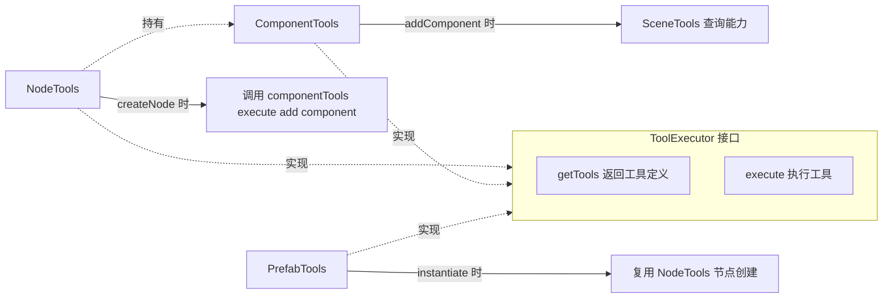

> `NodeTools` 内部 `private componentTools = new ComponentTools()`,创建节点后调 `componentTools.execute('add_component', ...)` 复用组件添加逻辑,组件添加内部又有多层回退。

### 5.4 工具类内部执行分发

每个工具类的 `execute(toolName, args)` 内部用 `switch(toolName)` 分发到私有方法,每个私有方法再按 `args.action` 二次分发:

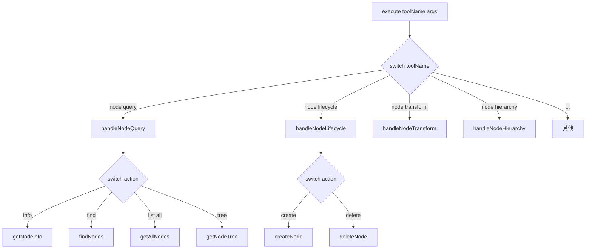

> 这是两级分发:工具级(toolName)→ 操作级(action)。50 个工具 × 平均 2.4 个 action = 约 120+ 个原子操作。

---

## 六、工具内部多层回退策略

### 6.1 回退架构总览

工具类对每个 Editor Message 调用都设计多层回退,应对 Cocos Creator 不同版本的 API 差异:

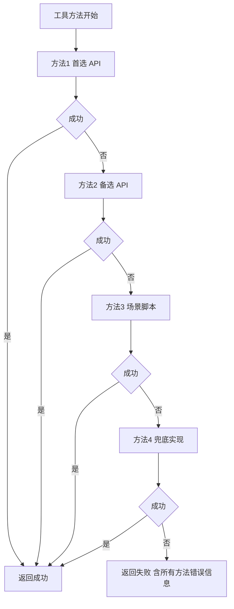

### 6.2 案例 addComponent 组件添加

`ComponentTools.addComponent` 的双层回退架构:

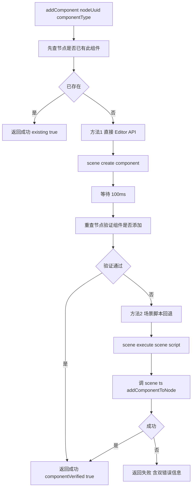

### 6.3 案例 removeComponent 组件移除

`ComponentTools.removeComponent` 的四级级联回退(最复杂的回退链):

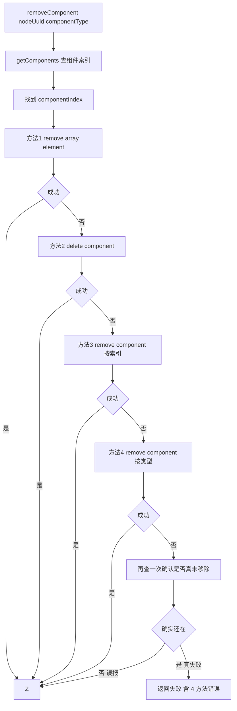

> 这种四级回退源于 Cocos Creator 不同版本(3.8.6 / 3.9 / 4.x)的 API 差异,同一操作有多种等价 API,逐一尝试以最大化兼容性。

### 6.4 案例 createNode 节点创建

`NodeTools.createNode` 展示了资源路径解析与验证闭环:

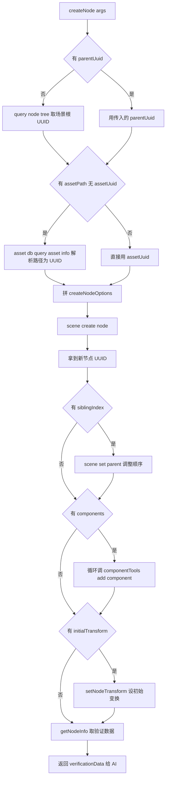

> 注意每步之间的 `await new Promise(r => setTimeout(r, 100))` 等待,这是给 Editor 完成异步操作的缓冲时间,体现跨进程消息的时序约束。

---

## 七、配置管理与持久化架构

### 7.1 双文件持久化

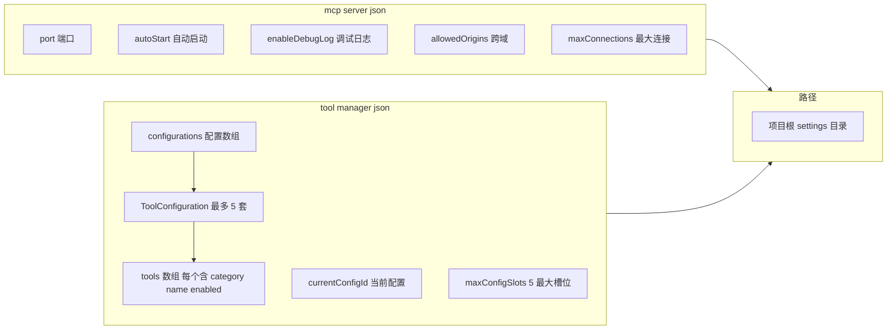

### 7.2 配置切换实时生效架构

工具配置的修改会实时同步到运行中的 MCPServer:

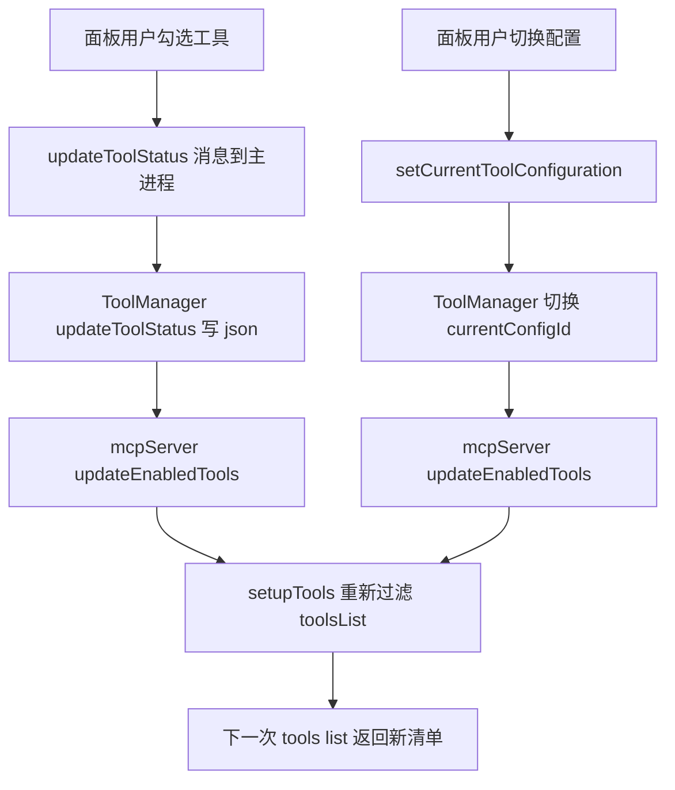

### 7.3 工具配置方案生命周期

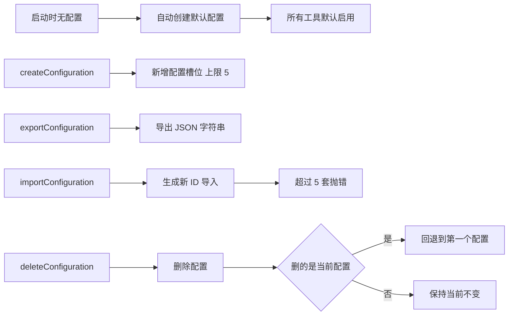

### 7.4 工具清单的两种来源

`ToolManager.initializeAvailableTools()` 有真实与后备两种来源:

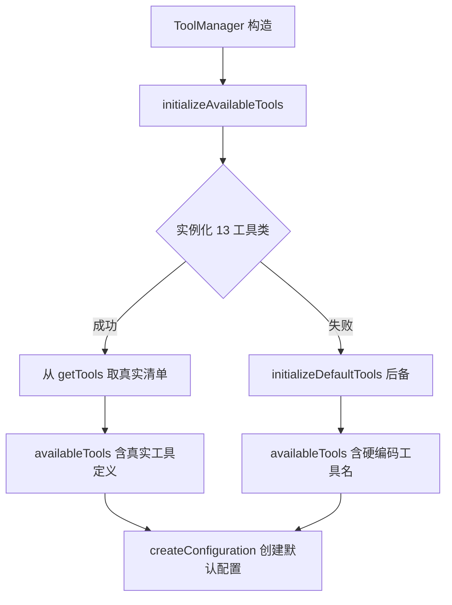

> 后备方案是硬编码的工具名清单(如 getCurrentSceneInfo / saveScene 等),仅当 13 个工具类实例化失败时启用,确保管理器面板不空。

---

## 八、生命周期时序架构

### 8.1 扩展启动流程

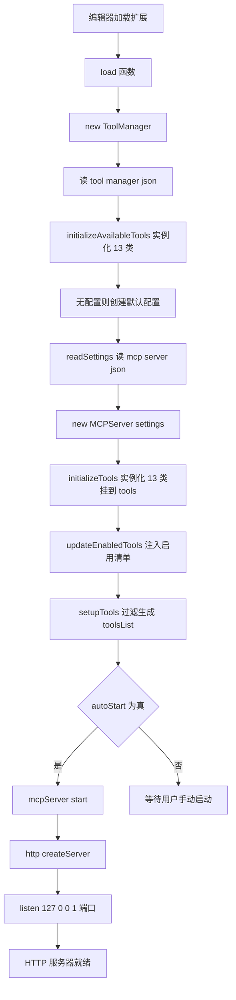

### 8.2 服务器启动时序

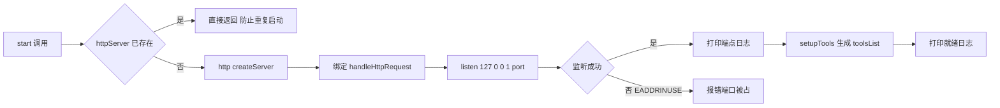

### 8.3 设置更新流程

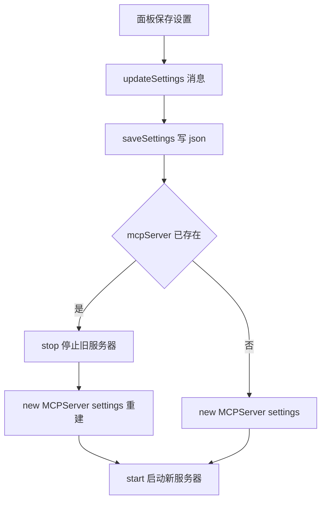

> 设置更新会**销毁旧 MCPServer 实例并重建**,而非修改字段。因为 HTTP 服务器无法动态换端口,只能重建。

### 8.4 卸载流程

```mermaid
flowchart LR
    A[unload 函数] --> B{mcpServer 存在}
    B -->|是| C[mcpServer stop]
    C --> D[httpServer close]
    D --> E[httpServer 置 null]
    E --> F[mcpServer 置 null]
    B -->|否| G[无操作]
```

---

## 九、错误处理与容错架构

### 9.1 三层容错体系

```mermaid
flowchart TD
    A[AI 请求] --> B[协议层容错]
    B --> C[JSON parse 失败]
    C --> D[fixCommonJsonIssues 修复]
    D --> E[修复后仍失败 返回 32700 错误]
    A --> F[路由层容错]
    F --> G[category 不存在]
    G --> H[返回 32603 错误]
    A --> I[执行层容错]
    I --> J[Editor Message 失败]
    J --> K[多层回退策略]
    K --> L[全部失败返回 ToolResponse success false]
    L --> M[错误信息含所有方法错误]
```

### 9.2 错误码体系

| 错误码 | 含义 | 触发场景 |
|------|------|------|
| -32700 | Parse error | JSON 解析失败且修复无效 |
| -32603 | 内部错误 | 工具执行异常或路由失败 |
| 200 | 成功 | HTTP 健康检查 |
| 400 | 请求错误 | API 路径无效或 JSON 不可修复 |
| 404 | 未找到 | 未知路径 |
| 500 | 服务器错误 | 未捕获异常 |

### 9.3 工具级错误封装

工具方法用 try-catch 包裹每个 Editor Message 调用,失败不抛异常,而是返回结构化错误:

```mermaid
flowchart LR
    A[工具方法] --> B[try Editor Message]
    B --> C{成功}
    C -->|是| D[返回 ToolResponse success true]
    C -->|否 抛异常| E[catch 捕获]
    E --> F[返回 ToolResponse success false]
    F --> G[error 字段含异常 message]
    F --> H[部分成功含 errors 数组]
```

> 设计哲学:**错误不抛出,而是返回**。AI 客户端拿到结构化的 `success: false` 可自主决定重试或换工具,不会因异常中断整个会话。

---

## 十、ToolResponse 闭环设计架构

### 10.1 响应字段设计

```mermaid
flowchart LR
    A[ToolResponse] --> B[success 必填 成败]
    A --> C[data 成功数据]
    A --> D[message 人类可读信息]
    A --> E[error 失败原因]
    A --> F[instruction 给 AI 的下一步建议]
    A --> G[warning 非阻断警告]
    A --> H[verificationData 自验证数据]
    A --> I[updatedProperties 本次改了哪些属性]
```

### 10.2 AI 调用闭环

```mermaid
flowchart LR
    A[AI 调用工具] --> B[MCPServer 执行]
    B --> C[ToolResponse 返回]
    C --> D[data 结果数据]
    C --> E[instruction 下一步建议]
    C --> F[verificationData 自验证数据]
    D --> G[AI 解析结果]
    E --> H[AI 决定下一步]
    F --> I[AI 自验证操作生效]
    G --> J[AI 调用下一个工具]
    H --> J
    I --> J
```

> 这是 v1.5.4 降低 50% Token 消耗的关键:单次调用返回「结果 + 建议 + 验证」三件套,AI 不必再来回查询确认,显著减少往返轮次。

---

## 十一、面板与主进程交互架构

### 11.1 面板 Vue 架构

```mermaid
flowchart TD
    A[Editor Panel define] --> B[template HTML 模板]
    A --> C[style CSS 样式]
    A --> D[ready 生命周期]
    D --> E[createApp Vue 3]
    E --> F[defineComponent McpServerApp]
    F --> G[setup Composition API]
    G --> H[响应式状态]
    G --> I[计算属性]
    G --> J[watch 监听]
    G --> K[方法调用 Editor Message]
    K --> L[Editor Message request cocos mcp server]
```

### 11.2 面板功能架构

```mermaid
flowchart TD
    A[默认面板] --> B[服务器标签页]
    A --> C[工具管理标签页]
    B --> B1[状态显示 运行停止 端口连接数]
    B --> B2[启动停止按钮]
    B --> B3[设置表单 端口 自动启动 调试日志]
    B --> B4[保存设置]
    C --> C1[配置选择器]
    C --> C2[工具列表 按分类分组]
    C --> C3[启用禁用勾选]
    C --> C4[配置 CRUD]
    C --> C5[导入导出]
    C1 --> D[Editor Message getToolManagerState]
    C3 --> E[Editor Message updateToolStatus]
    C4 --> F[Editor Message create update delete Configuration]
    C5 --> G[Editor Message export import Configuration]
```

### 11.3 面板内置 i18n

面板组件内部自带中英双语字典(与外层 `i18n/zh.js` 不同):

```mermaid
flowchart LR
    A[面板 setup] --> B[translations 对象]
    B --> C[zh 中文键值]
    B --> D[en 英文键值]
    C --> E[品牌区 语言 标签页]
    C --> F[服务器状态 操作按钮]
    C --> G[工具管理 配置操作]
    E --> H[t 函数按当前语言取值]
    D --> H
```

---

## 十二、类型系统架构

### 12.1 核心接口关系

```mermaid
flowchart TD
    A[MCPServerSettings] --> A1[port autoStart enableDebugLog allowedOrigins maxConnections]
    B[ToolDefinition] --> B1[name description inputSchema]
    C[ToolResponse] --> C1[success data message error instruction warning verificationData updatedProperties]
    D[ToolExecutor 接口] --> D1[getTools 返回 ToolDefinition 数组]
    D --> D2[execute 执行返回 ToolResponse]
    E[ToolConfig] --> E1[category name enabled description]
    F[ToolConfiguration] --> F1[id name description tools 时间戳]
    G[ToolManagerSettings] --> G1[configurations currentConfigId maxConfigSlots]
    H[ToolManagerState] --> H1[availableTools currentConfiguration configurations maxConfigSlots]
    D -.实现.-> I[13 个工具类]
    D -.实现.-> J[NodeTools 等]
```

### 12.2 类型分层

| 层级 | 类型 | 作用 |
|------|------|------|
| 配置层 | MCPServerSettings ServerStatus | 服务器配置与状态 |
| 协议层 | ToolDefinition ToolResponse | MCP 工具定义与响应 |
| 执行层 | ToolExecutor 接口 | 工具类契约 |
| 数据层 | NodeInfo ComponentInfo SceneInfo PrefabInfo AssetInfo ProjectInfo | 业务实体 |
| 管理层 | ToolConfig ToolConfiguration ToolManagerSettings ToolManagerState | 配置管理 |
| 调试层 | ConsoleMessage PerformanceStats ValidationIssue ValidationResult | 调试验证 |

---

## 十三、架构设计原则总结

### 13.1 七大架构原则

```mermaid
mindmap
  root((架构原则))
    分层隔离
      协议接入层
      工具路由层
      执行层
      编辑器通信层
    操作码统一
      category toolName 命名
      action 子操作
      降低 AI 调用复杂度
    多层回退
      直接 Editor API
      场景脚本备用
      多种等价 API 级联
    验证闭环
      操作后重查
      verificationData
      instruction 建议
    配置可持久化
      双 json 文件
      5 套方案
      实时同步
    协议容错
      JSON 自动修复
      错误不抛出
      结构化返回
    进程隔离
      场景操作只能在场景进程
      主进程只发消息
```

### 13.2 架构权衡分析

| 设计选择 | 权衡 | 取舍 |
|------|------|------|
| HTTP 而非 stdio | 牺牲 PRO 版的 Streamable HTTP 省 Token | 换取跨平台兼容与浏览器可调 |
| 操作码统一 | 工具数从 150 降到 50 | 换取 AI 调用成功率与 Token 节省 |
| 多层回退 | 代码冗长 try-catch 嵌套 | 换取多版本 Cocos 兼容性 |
| 错误返回不抛出 | 失败不阻断会话 | 换取 AI 自主决策能力 |
| 重建而非改字段 | 设置更新销毁 MCPServer | 换取 HTTP 端口切换的简单实现 |
| 后备硬编码清单 | 增加维护成本 | 换取工具类实例化失败时面板不空 |

---

## 十四、类比理解

把这套架构类比成一个「智能翻译服务公司」:

```mermaid
flowchart TD
    A[外国客户 AI] --> B[前台 MCPServer]
    B --> C[接电话 HTTP 服务器]
    C --> D[翻译器 fixCommonJsonIssues 校音]
    D --> E[分单员 路由器]
    E --> F[查服务目录 enabledTools]
    E --> G[分发到 13 个业务部门]
    G --> H1[场景部]
    G --> H2[节点部]
    G --> H3[组件部]
    G --> H4[其他 10 个部]
    H3 --> I[施工有多种工具 4 种方法级联]
    I --> J[现场施工队 scene ts]
    J --> K[cc 引擎施工]
    K --> L[返回施工报告 ToolResponse]
    L --> M[含结果 建议 验证数据 三件套]
    M --> A
```

- **前台 MCPServer**:接电话(HTTP)、查手册(`tools/list`)、分订单(路由)
- **13 个业务部门**:每个有自己的工种(`action`),部门间可借人(组合复用)
- **`category_toolName`**:部门代号 + 工种名,前台按第一段(部门)分拣
- **`enabledTools`**:服务目录,ToolManager 是目录管理员,实时增删条目并通知前台
- **`scene.ts`**:现场施工队,前台/部门不能直接动场景,必须派单到施工队
- **多层回退**:施工有 4 种工具,一种坏了换下一种,全坏才报失败
- **`ToolResponse.instruction`**:施工完顺便给客户一张「下一步建议单」
- **`fixCommonJsonIssues`**:客户口音重,前台有翻译器校音后再处理
- **重建而非改字段**:换办公室(端口)只能搬家,不能原地改门牌

---

## 十五、参考引用

### 15.1 源码文件索引

| 架构维度 | 源码位置 |
|------|------|
| 扩展主进程入口 | `cocos-mcp-server/source/main.ts` |
| MCP 协议与 HTTP 服务器 | `cocos-mcp-server/source/mcp-server.ts`（initializeTools 第 44-65 行，setupTools 第 101-136 行，executeToolCall 第 138-148 行，handleMessage 第 244-291 行） |
| 场景脚本 | `cocos-mcp-server/source/scene.ts` |
| 设置持久化 | `cocos-mcp-server/source/settings.ts` |
| 工具配置管理 | `cocos-mcp-server/source/tools/tool-manager.ts`（initializeAvailableTools 第 81-136 行，后备清单第 138-229 行） |
| 类型契约 | `cocos-mcp-server/source/types/index.ts` |
| JSON 容错 | `cocos-mcp-server/source/utils/json-utils.ts` |
| 组件多层回退 | `cocos-mcp-server/source/tools/component-tools.ts`（addComponent 第 315-399 行，removeComponent 第 401-475 行） |
| 节点创建验证闭环 | `cocos-mcp-server/source/tools/node-tools.ts`（createNode 第 535-713 行） |
| 13 个工具类 | `cocos-mcp-server/source/tools/*.ts` |
| 面板 Vue 架构 | `cocos-mcp-server/source/panels/default/index.ts` |
| 扩展清单 | `cocos-mcp-server/package.json`（contributions.messages 与 contributions.scene.script） |

### 15.2 关键源码行号速查

| 架构机制 | 文件 | 行号 |
|------|------|------|
| 工具注册 13 类实例化 | `mcp-server.ts` | 44-65 |
| enabledTools 过滤 | `mcp-server.ts` | 101-136 |
| category 路由切分 | `mcp-server.ts` | 138-148 |
| MCP 协议握手 initialize | `mcp-server.ts` | 259-271 |
| JSON-RPC 分发 | `mcp-server.ts` | 244-291 |
| 简化 REST 接口 | `mcp-server.ts` | 308-370 |
| addComponent 双层回退 | `component-tools.ts` | 315-399 |
| removeComponent 四级级联 | `component-tools.ts` | 401-475 |
| createNode 资源解析与验证 | `node-tools.ts` | 535-713 |
| 自动创建默认配置 | `tool-manager.ts` | 14-19 |
| 后备硬编码清单 | `tool-manager.ts` | 138-229 |
| 扩展 load 生命周期 | `main.ts` | 203-223 |
| 设置更新重建 MCPServer | `main.ts` | 66-76 |

### 15.3 外部参考

- MCP 协议规范（协议版本 2024-11-05）：https://modelcontextprotocol.io/
- JSON-RPC 2.0 规范：https://www.jsonrpc.org/specification
- Cocos Creator 扩展开发文档：https://docs.cocos.com/creator/manual/zh/editor/extension/
- Cocos Creator 编辑器消息系统：https://docs.cocos.com/creator/manual/zh/editor/extension/messages.html
- 主仓库 CLAUDE.md：`CLAUDE.md`（submodule 来源、acp.sh 工作流、版本不匹配提示）
- 同目录工具清单文档：`Docs/cocos-mcp-server源码分析.md`（50 个工具与 120+ action 操作码完整清单）
