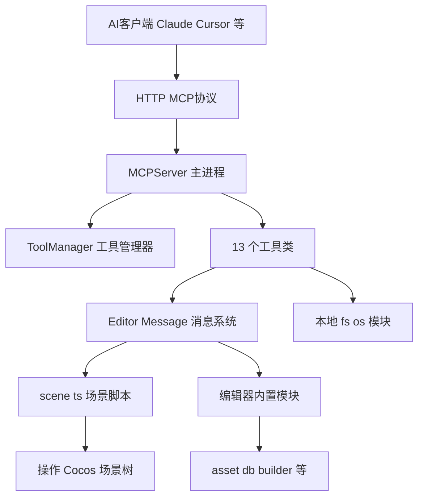
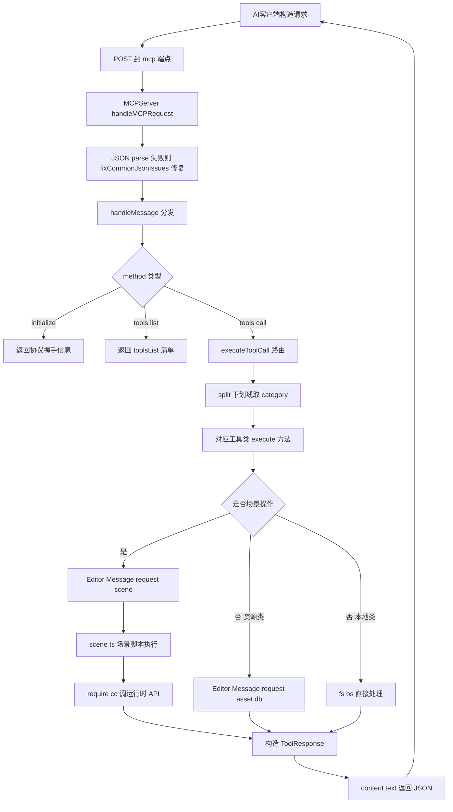

# Cocos MCP Server 源码分析文档

> 基于 `cocos-mcp-server` v1.5.4 开源版源码整理。50 个核心工具、13 个工具类、约 120+ 个 action 操作码，覆盖 99% 的 Cocos Creator 编辑器操作。

---

## 一、项目概览

### 1.1 是什么

`cocos-mcp-server` 是一个 **Cocos Creator 3.8.6+ 编辑器扩展**，内嵌一个基于 Node `http` 的 MCP（Model Context Protocol）服务器。它让 AI 客户端（Claude / Cursor / Windsurf 等）通过标准化的 HTTP 协议直接操控 Cocos Creator 编辑器：读写场景树、增删节点组件、管理预制体与资源、控制构建预览、调试日志等。

### 1.2 关键事实

| 项 | 值 |
|------|------|
| 版本 | 1.5.4（开源版，PRO 版独立演进至 1.7.8） |
| 编辑器要求 | Cocos Creator >= 3.8.6 |
| 通信协议 | HTTP + JSON-RPC 2.0（MCP 协议） |
| 默认端口 | 3000，端点 `http://127.0.0.1:3000/mcp` |
| 工具总数 | 50 个核心工具（category_name 命名） |
| 工具类总数 | 13 个，按域划分 |
| 操作码总数 | 约 120+ 个 action 子操作 |
| 技术栈 | TypeScript（strict）+ Vue 3（面板）+ Node http |
| 编译产物 | `dist/main.js`（扩展入口）/ `dist/scene.js`（场景脚本） |

### 1.3 在仓库中的位置

仓库根目录本身是 git 仓库，`cocos-mcp-server/` 是一个 **git submodule**，指向上游 `mickorz/cocos-mcp-server`：

```
CocosMCP（根仓库）
├── CocosMCP/              # Cocos Creator 游戏项目（3.7.3）
├── cocos-mcp-server/      # git submodule，编辑器扩展
└── acp.sh / acpExample.sh # 一键提交主仓库 + submodule
```

> 注意：扩展要求 `>=3.8.6`，而游戏项目是 `3.7.3`，在该项目里启用扩展可能需要升级编辑器版本。

---

## 二、整体架构

### 2.1 分层架构



### 2.2 三个进程的角色

| 进程 | 文件 | 职责 |
|------|------|------|
| 扩展主进程 | `source/main.ts` + `source/mcp-server.ts` | 启动 HTTP 服务器、注册工具、响应编辑器消息、管理生命周期 |
| 场景进程 | `source/scene.ts`（`package.json` 的 `contributions.scene.script`） | 真正的节点/组件增删改查，通过 `require('cc')` 调运行时 API |
| 面板进程 | `source/panels/default/index.ts` | Vue 3 面板 UI，设置服务器、管理工具配置 |

> 节点与组件的真实增删改只能在场景进程执行，主进程通过 `Editor.Message.request('scene', ...)` 调用 `scene.ts` 暴露的方法。

---

## 三、目录结构

```
cocos-mcp-server/
├── source/                          # TypeScript 源码
│   ├── main.ts                     # 扩展主进程入口
│   ├── mcp-server.ts               # MCPServer 类（HTTP + MCP 协议）
│   ├── scene.ts                    # 场景脚本（运行在场景进程）
│   ├── settings.ts                 # 服务器设置读写
│   ├── types/index.ts              # 全局类型定义
│   ├── utils/json-utils.ts         # JSON 容错修复
│   ├── tools/                      # 13 个工具类 + 工具管理器
│   │   ├── tool-manager.ts
│   │   ├── scene-tools.ts
│   │   ├── node-tools.ts
│   │   ├── component-tools.ts
│   │   ├── prefab-tools.ts
│   │   ├── project-tools.ts
│   │   ├── debug-tools.ts
│   │   ├── preferences-tools.ts
│   │   ├── server-tools.ts
│   │   ├── broadcast-tools.ts
│   │   ├── scene-view-tools.ts
│   │   ├── reference-image-tools.ts
│   │   ├── asset-advanced-tools.ts
│   │   └── validation-tools.ts
│   └── panels/                     # Vue 3 面板
│       ├── default/index.ts        # 主面板（服务器 + 工具管理）
│       └── tool-manager/index.ts  # 工具管理器面板
├── dist/                            # tsc 编译产物（运行时加载）
├── static/                          # 图标 / 面板模板 / 样式
├── i18n/                            # 国际化（en.js / zh.js）
├── scripts/preinstall.js            # npm install 前联网校验 creator-types 版本
├── package.json                     # 扩展清单（main = ./dist/main.js）
├── base.tsconfig.json               # TS 基础配置
└── tsconfig.json                    # 项目 TS 配置（继承 base）
```

---

## 四、核心模块详解

### 4.1 main.ts（扩展主进程入口）

导出两类内容：

1. **`methods` 对象**：响应 `package.json` 中 `contributions.messages` 声明的编辑器消息，包括：
   - `openPanel` / `startServer` / `stopServer` / `getServerStatus` / `updateSettings` / `getServerSettings`
   - `getToolsList` / `getEnabledTools`
   - 工具配置管理：`getToolManagerState` / `createToolConfiguration` / `updateToolConfiguration` / `deleteToolConfiguration` / `setCurrentToolConfiguration` / `updateToolStatus` / `updateToolStatusBatch` / `exportToolConfiguration` / `importToolConfiguration`

2. **`load()` / `unload()` 生命周期**：
   - `load()`：初始化 `ToolManager`，读取设置，构造 `MCPServer` 单例，把 `ToolManager.getEnabledTools()` 同步到 `MCPServer`；若 `settings.autoStart` 为真则自动启动。
   - `unload()`：停止并置空 `MCPServer`。

> 全局单例 `mcpServer` 与 `toolManager` 是模块级变量。`updateToolStatus` 等方法在修改配置后会主动调用 `mcpServer.updateEnabledTools()` 让运行中的服务器实时生效。

### 4.2 mcp-server.ts（MCPServer 类）

这是协议核心。关键成员与方法：

| 成员/方法 | 作用 |
|------|------|
| `tools: Record<string, ToolExecutor>` | 13 个工具类实例，key 为 category 前缀（scene/node/...） |
| `toolsList: ToolDefinition[]` | 对外暴露的工具清单（经 enabledTools 过滤） |
| `enabledTools: any[]` | 启用列表，由 ToolManager 注入 |
| `initializeTools()` | 实例化 13 个工具类挂到 `this.tools` |
| `start()` | `http.createServer` 监听 `127.0.0.1:settings.port`，监听后调用 `setupTools()` |
| `setupTools()` | 按 enabledTools 过滤，拼出 `${category}_${tool.name}` 工具名 |
| `executeToolCall(name, args)` | 用 `name.split('_')[0]` 取 category 路由到工具类 `execute()` |
| `handleHttpRequest()` | HTTP 入口，处理 CORS、OPTIONS、路由分发 |
| `handleMCPRequest()` | `/mcp` POST，JSON-RPC 2.0 |
| `handleMessage()` | 分发 `initialize` / `tools/list` / `tools/call` |
| `handleSimpleAPIRequest()` | `/api/{category}/{toolName}` 简化 REST 接口 |
| `getSimplifiedToolsList()` | `/api/tools` GET，返回带 curl 示例的工具清单 |
| `fixCommonJsonIssues()` | JSON 解析失败时的容错修复（来自 utils） |

**MCP 协议握手**（`initialize` 方法返回）：
- `protocolVersion: '2024-11-05'`
- `capabilities: { tools: {} }`
- `serverInfo: { name: 'cocos-mcp-server', version: <package.json version> }`

**工具命名与路由机制**（v1.5.4 核心）：

```
工具全名 = category + "_" + toolName
例如:   scene + "_" + scene_management  =>  scene_scene_management

路由时:
  parts = toolName.split('_')
  category = parts[0]                        // scene
  toolMethodName = parts.slice(1).join('_') // scene_management
  this.tools[category].execute(toolMethodName, args)
```

> 因为 `toolName` 自身也含下划线（如 `scene_management`），路由时只切第一段作为 category，剩余用 `join('_')` 还原。

### 4.3 scene.ts（场景脚本）

由 `package.json` 的 `contributions.scene.script` 声明，运行在 **场景进程**。导出 `methods` 对象，方法名即 `Editor.Message.request('scene', <method>, ...)` 的 method 名：

| 方法 | 作用 |
|------|------|
| `createNewScene()` | `require('cc')` 创建 Scene 并 `director.runScene` |
| `addComponentToNode(uuid, type)` | `js.getClassByName` 取类，`node.addComponent` |
| `removeComponentFromNode(uuid, type)` | `node.getComponent` + `node.removeComponent` |
| `createNode(name, parentUuid?)` | `new Node` 并按父级挂载 |
| `getNodeInfo(uuid)` | 返回 position/rotation/scale/active/children/components |
| `getAllNodes()` | 递归收集场景所有节点 |
| `findNodeByName(name)` | `scene.getChildByName` |
| `getCurrentSceneInfo()` | 返回场景名/UUID/根节点数 |
| `setNodeProperty(uuid, prop, value)` | 按 position/rotation/scale/active/name 分支，否则直接赋值 |
| `getSceneHierarchy(includeComponents)` | 递归构建层级树，可选带组件 |
| `createPrefabFromNode(uuid, path)` | 模拟实现（注释说明真预制体需 Editor API） |
| `setComponentProperty(uuid, type, prop, value)` | 对 Sprite.spriteFrame / Material / Label.string 做资源加载特殊处理 |

> `setComponentProperty` 对 `cc.Sprite.spriteFrame`、`cc.Sprite/MeshRenderer.material` 通过 `assetManager.resources.load` + `loadAny` 双重回退加载资源，兼容 uuid 与路径两种入参。

### 4.4 settings.ts（设置管理）

- 配置文件：`<项目>/settings/mcp-server.json`
- 默认值：`{ port: 3000, autoStart: false, enableDebugLog: false, allowedOrigins: ['*'], maxConnections: 10 }`
- `readSettings()` / `saveSettings()` 用 fs 同步读写，自动建目录

### 4.5 tool-manager.ts（工具管理器）

负责工具的启用/禁用、配置多套方案、持久化与导入导出。

- 配置文件：`<项目>/settings/tool-manager.json`
- 数据结构：`ToolManagerSettings { configurations: ToolConfiguration[], currentConfigId, maxConfigSlots: 5 }`
- 启动时 `initializeAvailableTools()` 实例化 13 个工具类取真实工具清单；若失败回退到 `initializeDefaultTools()` 的硬编码后备清单
- 无配置时自动创建「默认配置」
- 配置槽位上限 5（`maxConfigSlots`）
- 关键方法：`createConfiguration` / `updateConfiguration` / `deleteConfiguration` / `setCurrentConfiguration` / `updateToolStatus` / `updateToolStatusBatch` / `exportConfiguration` / `importConfiguration` / `getEnabledTools` / `getToolManagerState`

### 4.6 types/index.ts（类型定义）

核心接口：

```text
MCPServerSettings        服务器配置
ToolDefinition           工具定义（name/description/inputSchema）
ToolResponse             工具响应（success/data/message/error/instruction/warning/verificationData）
ToolExecutor             工具执行器接口（getTools + execute）
ToolConfig               单工具配置（category/name/enabled/description）
ToolConfiguration        工具配置方案（id/name/description/tools/时间戳）
ToolManagerSettings      管理器持久化结构
```

> `ToolResponse` 设计很有意思：除了 `success/data`，还有 `instruction`（给 AI 的后续操作指引）、`warning`、`verificationData`、`updatedProperties`，专门为 AI 调用闭环设计。

### 4.7 utils/json-utils.ts（JSON 容错）

`fixCommonJsonIssues(str)` 在 JSON.parse 失败时修复：未转义反斜杠、尾逗号、单引号转双引号、控制字符。AI 生成的 JSON 常有这些瑕疵，是协议健壮性的关键兜底。

---

## 五、13 个工具类与 50 个工具完整清单

### 5.1 工具类总览

| # | 工具类 | category 前缀 | 工具数 | 主要通信 |
|---|--------|--------------|-------|---------|
| 1 | SceneTools | `scene` | 5 | scene / asset-db |
| 2 | NodeTools | `node` | 8 | scene / asset-db |
| 3 | ComponentTools | `component` | 4 | scene |
| 4 | PrefabTools | `prefab` | 4 | scene / asset-db |
| 5 | ProjectTools | `project` | 2 | builder / project |
| 6 | DebugTools | `debug` | 3 | console / scene / fs |
| 7 | PreferencesTools | `preferences` | 3 | preferences |
| 8 | ServerTools | `server` | 2 | server / os |
| 9 | BroadcastTools | `broadcast` | 2 | （模拟实现，Editor.Message.on/off 被注释） |
| 10 | SceneViewTools | `sceneView` | 5 | scene |
| 11 | ReferenceImageTools | `referenceImage` | 4 | reference-image |
| 12 | AssetAdvancedTools | `assetAdvanced` | 5 | asset-db / fs |
| 13 | ValidationTools | `validation` | 3 | 纯本地，不调 Editor.Message |
| | **合计** | | **50** | |

### 5.2 工具清单（按 category 分组）

> 命名规则：`<category>_<toolName>`。多数工具用 `action` 参数区分子操作（约 120+ 个 action 值）。下表「操作」列括注关键 action 值。

#### scene（场景，5 个）

| 完整工具名 | 描述 | 关键 action |
|------|------|------|
| `scene_scene_management` | 场景管理 | get_current / get_list / open / save / create / save_as / close |
| `scene_scene_hierarchy` | 场景层级树 | （无 action，直接 includeComponents 参数） |
| `scene_scene_execution_control` | 执行控制 | execute_component_method / execute_scene_script / restore_prefab |
| `scene_scene_state_management` | 状态管理 | create_snapshot / abort_snapshot / begin_undo / end_undo / cancel_undo / soft_reload |
| `scene_scene_query_system` | 查询系统 | check_ready / check_dirty / list_classes / list_components / check_script / find_nodes_by_asset |

#### node（节点，8 个）

| 完整工具名 | 描述 | 关键 action |
|------|------|------|
| `node_node_query` | 节点查询（查找前必用） | info / find / find_by_name / list_all / detect_type / tree |
| `node_node_lifecycle` | 创建删除 | create / delete |
| `node_node_transform` | 修改变换属性 | （无 action，直接传 position/rotation/scale/name/active 等） |
| `node_node_hierarchy` | 层级操作 | move / duplicate |
| `node_node_clipboard` | 剪贴板 | copy / paste / cut |
| `node_node_property_management` | 重置属性 | reset_property / reset_transform / reset_component |
| `node_node_array_management` | 数组元素 | move_element / remove_element |
| `node_node_script_management` | 脚本挂载 | attach / remove |

#### component（组件，4 个）

| 完整工具名 | 描述 | 关键参数 |
|------|------|------|
| `component_component_manage` | 增删内置组件 | action: add / remove |
| `component_component_query` | 查询组件 | action: list / info / available_types（移除前必用此取 CID） |
| `component_set_component_property` | 设置属性 | propertyType 必填：string/number/boolean/integer/float/color/vec2/vec3/size/node/component/spriteFrame/prefab/asset/nodeArray/colorArray/numberArray/stringArray；支持单个或 `properties` 批量 |
| `component_configure_click_event` | 配置点击事件 | **operation**（非 action）: add / modify / remove / clear |

#### prefab（预制体，4 个）

| 完整工具名 | 描述 | 关键 action |
|------|------|------|
| `prefab_prefab_browse` | 浏览校验 | list / info / validate |
| `prefab_prefab_lifecycle` | 创建删除 | create / delete |
| `prefab_prefab_instance` | 实例管理 | instantiate / unlink / apply / revert |
| `prefab_prefab_edit` | 编辑模式 | enter / save / exit / test |

#### project（项目，2 个）

| 完整工具名 | 描述 | 关键 action |
|------|------|------|
| `project_project_manage` | 项目核心 | run / build / get_info / get_settings |
| `project_project_build_system` | 构建系统 | get_build_settings / open_build_panel / check_builder_status |

#### debug（调试，3 个）

| 完整工具名 | 描述 | 关键 action |
|------|------|------|
| `debug_debug_console` | 控制台 | get_logs / clear |
| `debug_debug_logs` | 日志文件 | read / search / info |
| `debug_debug_system` | 系统信息 | editor_info / performance |

#### preferences（偏好设置，3 个）

| 完整工具名 | 描述 | 关键 action |
|------|------|------|
| `preferences_preferences_manage` | 偏好管理 | open_panel / get_config / set_config / reset_config |
| `preferences_preferences_query` | 偏好查询 | get_all / list_categories / search_settings |
| `preferences_preferences_backup` | 偏好备份 | export / validate_backup |

#### server（服务器，2 个）

| 完整工具名 | 描述 | 关键 action |
|------|------|------|
| `server_server_information` | 网络信息 | get_ip_list / get_sorted_ip_list / get_port / get_comprehensive_status |
| `server_server_connectivity` | 连通性 | test_connectivity / get_network_interfaces |

#### broadcast（广播，2 个）

| 完整工具名 | 描述 | 关键 action |
|------|------|------|
| `broadcast_broadcast_log_management` | 消息日志 | get_log / clear_log |
| `broadcast_broadcast_listener_management` | 监听器 | start_listening / stop_listening / get_active_listeners |

> 注意：BroadcastTools 的 `Editor.Message.on/off` 调用被注释（注释称"Editor.Message API 可能不支持"），当前为模拟实现，预定义监听 11 个广播消息（build-worker:ready、scene:ready、asset-db:asset-add 等）。

#### sceneView（场景视图，5 个）

| 完整工具名 | 描述 | 关键 action |
|------|------|------|
| `sceneView_scene_view_gizmo_management` | Gizmo 工具 | change_tool / query_tool / change_pivot / query_pivot / change_coordinate / query_coordinate / query_view_mode |
| `sceneView_scene_view_mode_control` | 2D3D 与网格 | change_2d_3d / query_2d_3d / set_grid / query_grid |
| `sceneView_scene_view_icon_gizmo` | 图标 Gizmo | set_3d_mode / query_3d_mode / set_size / query_size |
| `sceneView_scene_view_camera_control` | 相机控制 | focus_on_nodes / align_camera_with_view / align_view_with_node |
| `sceneView_scene_view_status_management` | 状态管理 | get_status（聚合 7 项查询）/ reset_view |

#### referenceImage（参考图片，4 个）

| 完整工具名 | 描述 | 关键 action |
|------|------|------|
| `referenceImage_reference_image_management` | 增删切换 | add / remove / switch / clear_all |
| `referenceImage_reference_image_query` | 查询 | get_config / get_current / list_all |
| `referenceImage_reference_image_transform` | 变换 | set_position / set_scale / set_opacity / set_data |
| `referenceImage_reference_image_display` | 显示 | refresh |

#### assetAdvanced（高级资源，5 个）

| 完整工具名 | 描述 | 关键 action |
|------|------|------|
| `assetAdvanced_asset_manage` | 资源管理 | import / delete / save_meta / generate_url |
| `assetAdvanced_asset_analyze` | 资源分析 | dependencies / manifest |
| `assetAdvanced_asset_system` | 系统操作 | check_ready / open_external / refresh |
| `assetAdvanced_asset_query` | 查询 | get_info / get_assets / find_by_name / get_details / query_path / query_uuid / query_url |
| `assetAdvanced_asset_operations` | 文件操作 | create / copy / move / delete / save / reimport / import |

> 注意：`asset_optimize`（纹理压缩）、`validate_refs`（引用校验）、`unused`（未使用资源检测）因 API 不可用被注释禁用。

#### validation（验证，3 个，纯本地）

| 完整工具名 | 描述 | 关键参数 |
|------|------|------|
| `validation_validate_json_params` | JSON 校验修复 | jsonString（必填，可为畸形 JSON） |
| `validation_safe_string_value` | 转义为 JSON 安全格式 | value（必填） |
| `validation_format_mcp_request` | 生成 MCP 调用请求 | toolName + arguments（必填） |

---

## 六、工具调用数据流

### 6.1 一次 AI 调用的完整链路



### 6.2 关键设计：ToolResponse 闭环

工具返回的 `ToolResponse` 不只是 `data`，还有为 AI 设计的辅助字段：

- `instruction`：给 AI 的下一步操作指引（例如"已创建节点，UUID=xxx，下一步可用 node_transform 修改位置"）
- `warning`：非阻断性警告
- `verificationData`：供 AI 自验证的数据
- `updatedProperties`：本次实际改了哪些属性

这种设计让 AI 单次调用即可拿到「结果 + 下一步建议 + 自验证数据」，显著降低 Token 消耗与来回轮次（README 称降低 50% Token）。

---

## 七、HTTP 接口规范

### 7.1 端点一览

| 方法 | 路径 | 作用 |
|------|------|------|
| POST | `/mcp` | MCP 协议入口（JSON-RPC 2.0） |
| GET | `/health` | 健康检查，返回 `{ status, tools }` |
| POST | `/api/{category}/{toolName}` | 简化 REST 接口（不走 JSON-RPC） |
| GET | `/api/tools` | 工具清单（含 curl 示例） |
| OPTIONS | * | CORS 预检 |

### 7.2 MCP 请求格式（JSON-RPC 2.0）

```json
{
  "jsonrpc": "2.0",
  "id": 1,
  "method": "tools/call",
  "params": {
    "name": "node_node_query",
    "arguments": { "action": "find", "pattern": "Button" }
  }
}
```

### 7.3 MCP 响应格式

成功：
```json
{
  "jsonrpc": "2.0",
  "id": 1,
  "result": {
    "content": [{ "type": "text", "text": "<JSON 字符串化的 ToolResponse>" }]
  }
}
```

错误：`error.code` 用 `-32700`（解析错误）/ `-32603`（执行错误）。

### 7.4 简化 REST 调用示例

```bash
curl -X POST http://127.0.0.1:3000/api/node/node_query \
  -H "Content-Type: application/json" \
  -d '{"action":"find","pattern":"Button"}'
```

响应：`{ "success": true, "tool": "node_node_query", "result": {...} }`

---

## 八、配置与持久化

### 8.1 两个持久化文件

| 文件 | 路径 | 作用 |
|------|------|------|
| `mcp-server.json` | `<项目>/settings/` | 服务器配置（端口/自动启动/调试日志/CORS/最大连接） |
| `tool-manager.json` | `<项目>/settings/` | 工具配置方案（最多 5 套，currentConfigId 指向当前激活） |

### 8.2 工具配置方案数据结构

```text
ToolManagerSettings
├── maxConfigSlots: 5              最大槽位
├── currentConfigId: string         当前激活配置 ID
└── configurations: ToolConfiguration[]
      ├── id / name / description
      ├── createdAt / updatedAt
      └── tools: ToolConfig[]       每个 { category, name, enabled, description }
```

### 8.3 启用过滤逻辑

`MCPServer.setupTools()`：
- `enabledTools` 为空 → 暴露全部 50 个工具
- `enabledTools` 非空 → 用 `${category}_${name}` 集合过滤

`ToolManager` 的 `getEnabledTools()` 返回当前激活配置中 `enabled=true` 的工具列表。面板切换配置或勾选单个工具时，`main.ts` 会立即调用 `mcpServer.updateEnabledTools()` 让运行中的服务器实时生效。

### 8.4 重要：升级前必删旧配置

README 明确警告：首次安装或升级前，必须删除 `<项目>/settings/mcp-server.json` 和 `tool-manager.json`，否则工具列表显示异常。

---

## 九、面板与 i18n

### 9.1 面板结构

`package.json` 声明一个 `default` 面板（dockable，600x500），入口 `dist/panels/default`。实际源码中：

- `source/panels/default/index.ts`：用 `Editor.Panel.define()` 定义，Vue 3 Composition API；模板与样式从 `static/template/default/index.html` 与 `static/style/default/index.css` 读取
- 内部组件 `McpServerApp`：内置中英双语 i18n 字典（与外层 `i18n/zh.js` 不同，面板内自带翻译）
- `source/panels/tool-manager/index.ts`：独立的工具管理器面板

### 9.2 i18n（i18n/zh.js / en.js）

提供菜单与面板文案键，例如：
- `extension_name` / `description` / `panel_title` / `open_panel`
- 工具分类文案：`scene_tools` / `node_tools` / `component_tools` / `prefab_tools` / `project_tools` / `debug_tools` / `preferences_tools` / `server_tools` / `broadcast_tools` / `scene_view_tools` / `reference_image_tools` / `asset_advanced_tools` / `validation_tools`
- 工具管理：`create_config` / `edit_config` / `delete_config` / `import_config` / `export_config` / `apply_config` / `select_all` / `deselect_all`
- 状态：`running` / `stopped` / `connected` / `disconnected` / `server_running` / `server_stopped`

---

## 十、构建与开发

### 10.1 依赖与编译

```bash
cd cocos-mcp-server
npm install      # preinstall 联网校验 @cocos/creator-types 版本
npm run build    # tsc，source/ -> dist/
npm run watch    # tsc -w 监听
```

- 扩展运行时加载 `dist/main.js`（`package.json` 的 `main` 字段）。**改了 source/ 必须重新 build，否则编辑器加载旧产物**。
- TS 配置：`tsconfig.json` 继承 `base.tsconfig.json`，`target ES2017 / CommonJS / strict`，types 为 `node` + `@cocos/creator-types/editor`；`rootDir=./source`、`outDir=./dist`。
- 依赖：`fs-extra` / `uuid` / `vue@3`；devDeps：`@cocos/creator-types` / `@types/node` / `@types/fs-extra` / `@types/uuid` / `typescript@5`。

### 10.2 加载扩展

构建后在 Cocos Creator 扩展管理器中加载（入口 `dist/main.js`），菜单 `扩展 > Cocos MCP Server` 打开面板。

### 10.3 添加新工具

1. 在 `source/tools/` 中创建新工具类，实现 `ToolExecutor` 接口（`getTools()` + `execute()`）
2. 在 `mcp-server.ts` 的 `initializeTools()` 中实例化并挂到 `this.tools`
3. 在 `tool-manager.ts` 的 `initializeAvailableTools()` 中同步注册
4. 工具会自动通过 MCP 协议暴露，命名遵循 `category_toolName + action` 模式

---

## 十一、重要约定与注意事项

1. **submodule 是第三方上游**：`cocos-mcp-server` 来自 `mickorz/cocos-mcp-server`。一般不在本仓库内修改其源码；如需定制应 fork 或向上游提 PR，再用 `acp.sh` 在 submodule 内提交并推送，主仓库随后更新指针。
2. **clone 后必须初始化 submodule**：`git submodule update --init --recursive`，否则目录为空。
3. **acp.sh 提交顺序不可颠倒**：先 submodule 后主仓库。若先提交主仓库，主仓库记录的会是 submodule 的旧 commit 指针。
4. **版本不匹配需留意**：扩展要求 `>=3.8.6`，而 `CocosMCP` 项目是 `3.7.3`，在该项目里启用扩展可能需要升级编辑器版本。
5. **忽略规则分层**：根目录 `.gitignore` 负责根级别（OS / IDE / 日志）；`CocosMCP/.gitignore` 忽略 `library/ temp/ build/ profiles/ local/ node_modules/`。提交前确认未把 `library/`、`temp/` 等大目录带入。
6. **JSON 容错是协议健壮性关键**：AI 生成的 JSON 常有未转义引号、尾逗号、单引号等问题，`fixCommonJsonIssues` 是兜底，但复杂畸形 JSON 仍可能失败，调用方应尽量规范。
7. **场景脚本能力有限**：`scene.ts` 的 `createPrefabFromNode` 是模拟实现，真正的预制体创建走主进程的 `Editor.Message.request('scene', 'create-prefab', ...)`，而非场景脚本。
8. **BroadcastTools 为模拟实现**：`Editor.Message.on/off` 被注释，当前广播日志为本地数组模拟，生产环境不要依赖其准确性。
9. **部分高级资源功能被禁用**：`asset_optimize`（纹理压缩）、`validate_refs`、`unused` 因 API 不可用被注释，需要这些能力可考虑 PRO 版。

---

## 十二、类比理解

为了更直观地理解这套架构，可以把它类比成一个「翻译服务公司」：

- **AI 客户端** = 说外语的客户，只会用标准 MCP 协议（HTTP + JSON-RPC）下单
- **MCPServer** = 公司前台，接电话、查手册（`tools/list`）、把订单分发给对应部门
- **13 个工具类** = 13 个业务部门（场景部、节点部、组件部、预制体部...），每个部门有自己的工种（`action` 操作码）
- **`category_toolName`** = 部门代号 + 工种名，前台按第一段（部门）分拣，剩余段还原成完整工种名交给部门
- **`enabledTools`** = 服务目录，客户只能点目录里列出的工种；ToolManager 是目录管理员，可随时增删条目并实时通知前台
- **`scene.ts`** = 「现场施工队」，主进程（前台/部门）不能直接动场景树，必须派单到场景进程（施工队）执行
- **`ToolResponse` 的 `instruction` 字段** = 施工完顺便给客户一张「下一步建议单」，让客户不用回来再问
- **`fixCommonJsonIssues`** = 客户口音重（JSON 写得不规范），前台有个翻译器帮忙「校音」后再处理

---

## 十三、参考引用

- 源码主目录：`cocos-mcp-server/source/`
- 扩展清单：`cocos-mcp-server/package.json`
- 主进程入口：`cocos-mcp-server/source/main.ts`
- MCP 协议实现：`cocos-mcp-server/source/mcp-server.ts`（`initializeTools` 第 44-65 行、`setupTools` 第 101-136 行、`executeToolCall` 第 138-148 行、`handleMessage` 第 244-291 行）
- 场景脚本：`cocos-mcp-server/source/scene.ts`
- 设置管理：`cocos-mcp-server/source/settings.ts`
- 工具管理器：`cocos-mcp-server/source/tools/tool-manager.ts`（`initializeAvailableTools` 第 81-136 行、后备清单第 138-229 行）
- 类型定义：`cocos-mcp-server/source/types/index.ts`
- JSON 容错：`cocos-mcp-server/source/utils/json-utils.ts`
- 13 个工具类：`cocos-mcp-server/source/tools/*.ts`
- 项目 README：`cocos-mcp-server/README.md`（含开源版更新日志与 Pro 版对比）
- 主仓库 CLAUDE.md：`CLAUDE.md`（submodule 来源、acp.sh 工作流、版本不匹配提示）
- MCP 协议规范参考：https://modelcontextprotocol.io/ （协议版本 2024-11-05）
