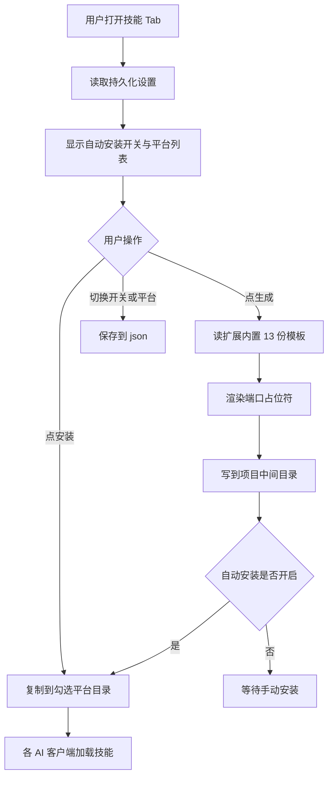
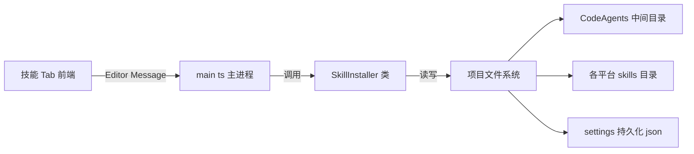

# Cocos MCP 技能 Tab 实现方案

> 为 cocos-mcp-server 面板新增「技能」Tab，一键生成 Cocos MCP 工作流 SKILL.md 并安装到各 AI 客户端，让 Claude Code / Cursor / opencode 等自动加载这些技能，更准确地调用 50 个工具。

## 一、背景与需求

参考 `E:/WorkProjects/game-cli/unity-mcp` 的「技能生成」+「安装选项」功能。unity-mcp 的做法是 spawn node 脚本正则扒 C# 源码生成 SKILL.md；cocos-mcp 这边采用更直接的方式：**手写工作流指南**。

需求确认（用户拍板）：

| 项 | 决定 |
|----|------|
| 新 Tab 位置 | 插在「服务器」和「工具管理」之间，三者并列 |
| 生成内容来源 | 手写 Cocos 工作流指南（非自动扒工具表） |
| 生成粒度 | 严格 13 个工具类各一份 SKILL.md |
| 内容产出 | Claude 写初版（用户可在中间目录二次编辑） |
| 安装平台 | Claude Code / Gemini CLI / Codex / Antigravity / opencode |
| 持久化 | 安装选项存 `settings/skill-installer.json` |

## 二、整体架构



面板、主进程、文件系统三层分工：



## 三、数据流

1. **生成** `generateSkills(port)`：
   - 读扩展内置手写模板 `static/skill-templates/<name>/SKILL.md`（13 份）
   - 渲染 `{{port}}` 占位符为当前 MCP 端口
   - 写到扩展目录下的中间目录 `cocos-mcp-server/CodeAgents/SkillAutoGenerate/<name>/SKILL.md` + `.last-generated` 时间戳
   - 同步确保 `cocos-mcp-server/CodeAgents/SkillCustomers/` 存在（用户手写 skill 区，首次生成时创建并写入 README 使用说明）
   - 若 `autoInstall=true` 自动触发安装

2. **安装** `installSkills()`：
   - 收集技能源（均在扩展目录 `cocos-mcp-server/CodeAgents/` 下）：`SkillAutoGenerate`（自动生成）+ `SkillCustomers`（用户手写，递归查找）
   - 对每个勾选平台，递归复制到 `<项目根>/<平台dir>/skills/<name>/`
   - 按目录存在探测各平台「已安装」状态

3. **持久化** `settings/skill-installer.json`：
   ```json
   {
     "autoInstall": false,
     "platforms": { "claude": true, "gemini": false, "codex": false, "antigravity": false, "opencode": false },
     "lastGenerated": ""
   }
   ```

## 四、技能生成与安装机制

### Simple API 调用约定（写入 SKILL.md 的 curl 示例）

cocos-mcp 的 HTTP 服务（默认端口 3001，绑定 127.0.0.1）提供 Simple API：

- 端点：`POST http://127.0.0.1:{port}/api/{category}/{tool_name}`
- category 是 camelCase：scene / node / component / prefab / project / debug / preferences / server / broadcast / sceneView / referenceImage / assetAdvanced / validation
- 参数走 JSON body（不是 query string），大多是 `{"action":"..."}`
- 成功响应 `{success, tool, result}`；失败 HTTP 500 `{success:false, error}`

> 重要陷阱：MCP 协议端点 `/mcp` 的工具名是双前缀（如 `project_project_manage`），而 Simple API 路径是 `/api/project/project_manage`（category 段 + 工具内部全名段）。SKILL.md 统一用 Simple API 写法，对 AI 和 curl 最友好。

### 5 个平台配置

5 个平台的 skill 目录格式完全统一，安装逻辑可复用：

| 平台 | 目标目录 |
|------|---------|
| Claude Code | `.claude/skills/<name>/SKILL.md` |
| Gemini CLI | `.gemini/skills/<name>/SKILL.md` |
| Codex | `.codex/skills/<name>/SKILL.md` |
| Antigravity | `.antigravity/skills/<name>/SKILL.md` |
| opencode | `.opencode/skills/<name>/SKILL.md` |

### MCP 配置生成（.mcp.json）

服务器 Tab 的「MCP 配置」区块：一键在项目根生成/更新 `.mcp.json`，让 AI 客户端（Claude Code 等）打开本项目时自动连接 cocos-mcp。这样新项目接入时不再需要手写 .mcp.json。放在服务器 Tab 是因为它和端口/连接信息同属"连接配置"，URL 端口直接来自该 Tab 的端口设置。

- 三个勾选项（持久化到 `settings/mcp-config.json`）：
  - cocos mcp：写入 `cocos-creator`（HTTP，URL 端口取自 `settings/mcp-server.json`，`http://127.0.0.1:{port}/mcp`）
  - chrome mcp：写入 `chrome-devtools`（stdio，`npx chrome-devtools-mcp@latest`）
  - 自动启动：勾选后扩展启动时自动生成 .mcp.json（参照服务器 autoStart）
- 勾选决定内容：勾选的写入，不勾选的从 .mcp.json 删除（cocos-creator / chrome-devtools 两个 key 完全由勾选决定），其他 MCP 配置保留
- 生成的格式（cocos + chrome 都勾选时）：
  ```json
  {
    "mcpServers": {
      "cocos-creator": { "type": "http", "url": "http://127.0.0.1:3001/mcp" },
      "chrome-devtools": { "command": "npx", "args": ["chrome-devtools-mcp@latest"] }
    }
  }
  ```
- 后端：`SkillInstaller.generateMcpConfig`（按勾选生成）、`updateMcpConfigSettings`（保存勾选）、`maybeAutoGenerateMcpConfig`（启动时自动）；前端按钮 `generateMcpConfig` + 勾选 `onToggleMcpOption`；消息 `generateMcpConfig` / `updateMcpConfigSettings`

## 五、13 份 SKILL.md 大纲

每份结构：YAML frontmatter（name 与目录名一致 / description）→ 何时使用 → 可用工具 → 典型工作流 → curl 示例 → 注意事项。frontmatter name 遵守 opencode 约束（小写字母 + 单连字符，与目录名一致）。

| category | 目录名 / name | 覆盖工具 |
|----------|---------------|---------|
| scene | cocos-scene | scene_management, scene_hierarchy, scene_execution_control, scene_state_management, scene_query_system |
| node | cocos-node | node_query, node_lifecycle, node_transform, node_hierarchy, node_clipboard, node_property_management, node_array_management, node_script_management |
| component | cocos-component | component_manage, component_query, set_component_property, configure_click_event |
| prefab | cocos-prefab | prefab_browse, prefab_lifecycle, prefab_instance, prefab_edit |
| project | cocos-project | project_manage, project_build_system |
| debug | cocos-debug | debug_console, debug_logs, debug_system |
| preferences | cocos-preferences | preferences_manage, preferences_query, preferences_backup |
| server | cocos-server | server_information, server_connectivity |
| broadcast | cocos-broadcast | broadcast_log_management, broadcast_listener_management |
| sceneView | cocos-sceneview | scene_view_gizmo_management, scene_view_mode_control, scene_view_icon_gizmo, scene_view_camera_control, scene_view_status_management |
| referenceImage | cocos-reference-image | reference_image_management, reference_image_query, reference_image_transform, reference_image_display |
| assetAdvanced | cocos-asset | asset_manage, asset_analyze, asset_optimize, asset_system, asset_query, asset_operations |
| validation | cocos-validation | validate_json_params, safe_string_value, format_mcp_request |

## 六、文件改动清单

### 修改
- `source/types/index.ts` — 新增 `SkillPlatformKey` / `SkillInstallerSettings` / `SkillPlatformState` 接口
- `source/main.ts` — methods 加 4 个（getSkillInstallerState / updateSkillInstallerSettings / generateSkills / installSkills），load() 初始化 SkillInstaller
- `package.json` — contributions.messages 加 4 个消息声明
- `static/template/vue/mcp-server-app.html` — tab-navigation 加「技能」按钮（服务器与工具管理之间），加技能 tab-content（生成区 + 安装区）
- `source/panels/default/index.ts` — translations 加中英文案；setup 加技能数据/computed/方法；switchTab 切到技能时加载状态；return 暴露
- `static/style/default/index.css` — 平台列表、消息提示样式

### 新增
- `source/skill-installer.ts` — SkillInstaller 类（持久化 + 生成 + 安装 + 已安装探测）
- `static/skill-templates/<13 个 name>/SKILL.md` — 13 份手写工作流模板（含 `{{port}}` 占位符）

## 七、验证方法

1. `cd cocos-mcp-server && npm run build` — tsc 无报错（已通过）
2. 完全退出并重启 Cocos Creator（刷新扩展不够），打开 Cocos MCP 面板
3. 确认 Tab 顺序：服务器 → 技能 → 工具管理
4. 技能 Tab：点「生成技能文档」→ 检查扩展目录 `cocos-mcp-server/CodeAgents/SkillAutoGenerate/` 出现 13 个目录 + `.last-generated`
5. 勾选 Claude Code → 点「安装到选中平台」→ 检查项目 `.claude/skills/cocos-*` 出现 13 份
6. 重启面板，确认自动安装开关 + 平台勾选 + 上次生成时间已持久化（不丢）
7. 读生成的 SKILL.md，确认 curl 端点端口正确、frontmatter name 与目录名一致

## 八、类比理解

可以把这套机制类比成「给工人发操作手册」：

- **生成** = 印刷厂印出 13 本岗位操作手册（每个工种一本：场景工、节点工、组件工…），先放到工厂中转仓（CodeAgents/SkillAutoGenerate），厂长可以在这里改写手册内容
- **安装** = 把手册分发到 5 个不同工种的工具箱（`.claude/skills` 等就是各家 AI 工人的工具箱），工人上岗时自动翻阅
- **中间目录** = 中转仓，既存自动印的版本，也存厂长手写的特制手册（CodeAgents/SkillCustomers），分发时一并发出

这样 AI 工人（Claude / Cursor / opencode）上岗时，工具箱里就有了一份「这个 Cocos 项目该怎么用 MCP 干活」的说明书，不用每次瞎摸索。

## 九、注意事项

- 改 source 后必须 `npm run build` + 完全重启 Cocos Creator（刷新扩展不够）
- SKILL.md 禁止 Emoji；中文为主
- opencode 要求 frontmatter `name` 与目录名严格一致，13 份命名遵守此约束
- curl 示例端口用生成时的 settings.port，文档内注明「端口以面板为准」

## 十、参考引用

- unity-mcp（参考来源）：`E:/WorkProjects/game-cli/unity-mcp`，其 `Editor/UI/GameWindow.cs` 的技能生成 Tab 与安装选项区块
- opencode Agent Skills 官方文档：https://opencode.ai/docs/skills/
- opencode Config（.opencode 目录约定）：https://opencode.ai/docs/config/
- Claude Code Skills 约定：`~/.claude/skills/`（opencode 兼容此路径）
- Model Context Protocol：https://modelcontextprotocol.io/
