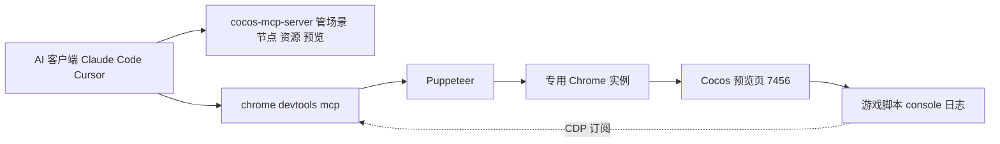

# 方案 A：chrome-devtools-mcp 零侵入日志方案

> **状态：已实测全绿并采用（2026-07-30）**。已配置进 `CocosMCP/.mcp.json`，`list_console_messages` 成功读到 7456 游戏日志。详见第五节实测结果。
> 定位：**零开发路径**。不在 cocos-mcp-server 写任何代码，直接在 AI 客户端配置官方 `chrome-devtools-mcp`，由它驱动一个专用 Chrome 连到 Cocos 预览（7456），读取浏览器 console / 网络 / 截图 / 性能。
> 关联问题：[获取浏览器预览游戏日志-问题分析与方案对比](./获取浏览器预览游戏日志-问题分析与方案对比.md)

---

## 一、原理

`chrome-devtools-mcp` 是 Chrome 官方（ChromeDevTools 组织）维护的 MCP server，内部用 **Puppeteer** 驱动 Chrome，通过 **CDP（Chrome DevTools Protocol）** 订阅浏览器事件，对 AI 暴露一组工具：

- `list_console_messages` / `get_console_message` —— 读浏览器 console（含级别、堆栈）
- 网络请求检查
- 页面截图 / 快照
- JavaScript 执行
- 性能分析
- 带 Source Map 的调用栈

它本身就是为了"让编程 AI 调试浏览器"而生，能力覆盖远超"只读 console"。

## 二、架构



**职责分离**：
- `cocos-mcp-server` 管编辑器侧（场景、节点、资源、开预览）
- `chrome-devtools-mcp` 管浏览器侧（日志、网络、截图、性能）

两者互不重复造轮子。

## 三、落地步骤

### 1. 确认预览在跑
用 `cocos-mcp-server` 的 `project_run`（browser）打开预览，确认 `http://localhost:7456` 可访问。

### 2. 在 AI 客户端配置 chrome-devtools-mcp

**Claude Code**（项目根 `.mcp.json`，本仓库已有此文件，追加一项即可）：
```json
{
  "mcpServers": {
    "cocos-mcp-server": { "...": "已有配置" },
    "chrome-devtools": {
      "command": "npx",
      "args": ["chrome-devtools-mcp@latest"]
    }
  }
}
```

**Cursor**（`~/.cursor/mcp.json` 或项目 `.cursor/mcp.json`）：同样的 `mcpServers` 结构。

> 也可用 CLI：`claude mcp add chrome-devtools -- npx chrome-devtools-mcp@latest`

### 3. （Chrome 136+ 注意）启动参数
若用 `--remote-debugging-port` 连接已有 Chrome，**必须同时指定一个非默认 `--user-data-dir`**（Chrome 136 起的安全限制），否则连不上：
```
chrome --remote-debugging-port=9222 --user-data-dir="C:/temp/chrome-debug"
```
较新 Chrome 还支持 `--autoConnect`，连接运行中的 Chrome 并弹窗让用户授权。

### 4. AI 读日志
AI 调 chrome-devtools-mcp 工具：
1. `navigate` 到 `http://localhost:7456`
2. `list_console_messages` 拿游戏 console 日志
3. （可选）`take_screenshot` / 网络检查 / 性能分析

## 四、关键坑

| 坑 | 说明 |
|----|------|
| **专用浏览器实例** | chrome-devtools-mcp 默认拉自己的 Chrome 实例，**不是你手开的那个预览窗口**。AI 调试时操作这个实例。 |
| Chrome 136+ 参数 | `--remote-debugging-port` 必须配 `--user-data-dir`，否则失败。 |
| 多 MCP 依赖 | 要求 AI 客户端支持同时配多个 MCP server（Claude Code / Cursor 都支持）。 |
| 预览刷新 | 游戏刷新后，需 AI 重新 `navigate` 或确认会话仍连在页面上。 |
| **cce:/ CORS 假象（重要）** | 若 `temp/programming` 脚本编译产物损坏（如某 chunk 缺失），外部 Chrome 连 7456 会刷 `cce:/internal` CORS 错、`window.cc` 为 undefined。**这不是协议不兼容，是编译产物问题**——关闭编辑器删 `temp/programming` 再重开重编译即可修复。详见对比文档"实测验证与排查插曲"。 |

## 五、实测结果（已完成，全绿）

验证日期：2026-07-30。用独立 MCP 客户端脚本直连 chrome-devtools-mcp（绕过会话重启）验证完整链路：

| 验证项 | 结果 |
|--------|:---:|
| chrome-devtools-mcp v1.6.0 启动 + initialize 握手 | 通过 |
| 暴露工具数 | 29 个 |
| navigate_page 到 7456 | 通过 |
| 引擎完整加载（`window.cc` = object） | 通过 |
| **list_console_messages 读游戏日志** | 通过 |
| CDP 底层捕获 console/warn/error/pageerror + 堆栈 | 全通过 |

`list_console_messages` 实际读到的游戏日志（节选）：
```
[info] [Physics][Bullet]: Using asmjs Bullet libs.
[info] [PHYSICS2D]: register box2d.
[info] [PHYSICS]: using bullet.
[log]  Cocos Creator v3.7.3
```

配置已写入 `CocosMCP/.mcp.json` 的 `chrome-devtools` 项。AI 客户端（Claude Code）需**重启会话**后加载 chrome-devtools-mcp，即可直接用 `list_console_messages` / `take_screenshot` / `evaluate_script` 等工具。

> 原验收标准（拿到 console.log、拿到报错堆栈）均已满足。还顺带抓到一条真实游戏 pageerror（`Cannot read properties of null`），证明能捕获运行时错误。

## 六、优缺点

**优点**
- **零开发**：cocos-mcp-server 一行不改
- **零侵入**：不改游戏代码、不改预览模板
- **能力最强**：console + 网络 + 截图 + 性能 + Source Map 堆栈
- 官方维护，工具链成熟

**缺点**
- AI 用**专用调试浏览器**（非手开预览窗口），开发者手开的窗口和 AI 调试窗口是两个
- 依赖 AI 客户端支持多 MCP
- Chrome 版本 / 启动参数有坑（136+ 的 user-data-dir）
- 多一个外部 MCP 进程依赖

## 七、适用场景

- AI 客户端可配多 MCP
- 追求最完整能力（不止日志，还要网络/截图/性能）
- 接受 AI 用专用调试浏览器实例
- 不要求所有能力集中在 cocos-mcp-server 单扩展内

## 八、关于 worktree

方案 A 的核心（chrome-devtools-mcp）**不在本仓库内**，是 AI 客户端层的外部配置。因此：
- **不需要为方案 A 建 git worktree**（worktree 隔离的是本仓库代码，A 不改本仓库代码）
- 方案 A 的"开发"= 写 `.mcp.json` 配置 + 本文档
- 方案 A 的"测试"= 配好后连预览验证（见第五节）

## 九、引用说明

- chrome-devtools-mcp 项目（Chrome 官方）：
  https://github.com/ChromeDevTools/chrome-devtools-mcp
- 官方博客：让编码 Agent 调试你的浏览器会话：
  https://developer.chrome.com/blog/chrome-devtools-mcp-debug-your-browser-session
- Chrome 136+ 远程调试参数变更（--user-data-dir 强制）：
  https://developer.chrome.com/blog/remote-debugging-port
- Chrome DevTools Protocol（底层 CDP）：
  https://chromedevtools.github.io/devtools-protocol/
