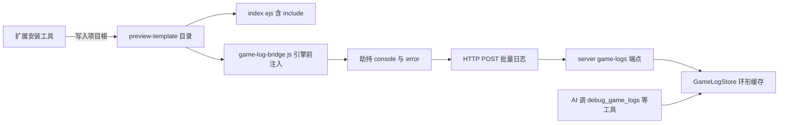

# 方案 B：preview-template 注入日志方案

> **状态：未采用（备选保留）**。经实测，方案 A（chrome-devtools-mcp）已完全满足"AI 读取游戏预览日志"需求且零开发，本方案 B 不实施，仅作技术备选存档。若未来要求"所有能力集中在 cocos-mcp-server 单扩展、不开外部 MCP"，再启用本方案。
> 定位：**集成进 cocos-mcp-server 单扩展**的轻量日志通道。用 Cocos 预览模板在引擎/游戏脚本之前注入日志桥，劫持 console + 错误事件，HTTP POST 到 server，AI 通过新工具查询。
> 关联问题：[获取浏览器预览游戏日志-问题分析与方案对比](./获取浏览器预览游戏日志-问题分析与方案对比.md)
> 关联对照：[方案A-chrome-devtools-mcp-零侵入日志方案](./方案A-chrome-devtools-mcp-零侵入日志方案.md)

---

## 一、原理

Cocos Creator 3.7 支持项目级 `preview-template/index.ejs` 自定义预览页。模板里 `<%- include(cocosTemplate, {}) %>` 是"引擎 + 项目脚本"入口。**把日志桥脚本放在这个 include 之前**，就能在引擎和游戏脚本执行之前安装日志捕获，从而拿到：

- `console.log/info/warn/error/debug`
- 未捕获的 JS 异常（`window.onerror` + `error` 事件）
- Promise 未处理异常（`unhandledrejection`）
- 脚本/图片/字体等**资源加载失败**
- 文件名、行号、列号、`Error.stack`

日志通过 HTTP POST（WebSocket 留 v2）发到 cocos-mcp-server 的 `/game-logs` 端点，存入 GameLogStore 环形缓存，AI 用 `debug_game_logs` 等工具查询。

## 二、架构



## 三、落地步骤（4 块改动）

### 1. 预览模板注入（项目级，扩展代写）

`preview-template/` 必须放在**目标游戏项目根目录**（如 `CocosMCP/CocosMCP/preview-template/`），扩展自身带不了。因此扩展提供一个**安装工具** `project_setup_game_log`，自动：
- 调编辑器菜单 / 直接写文件，生成标准 `index.ejs`（避免手写模板语法出错）
- 在 `<%- include(cocosTemplate, {}) %>` **之前**插入 `<script src="/game-log-bridge.js"></script>`
- 写入 `game-log-bridge.js`

> 坑：若 `index.html` 与 `index.ejs` 同时存在，**index.html 会覆盖 index.ejs**，只保留 ejs。

### 2. game-log-bridge.js（浏览器侧，引擎前执行）

职责：
1. 保存原始 console 方法
2. 包装 `console.log/info/warn/error/debug`
3. 监听 `error`（捕获 + 冒泡）
4. 监听 `unhandledrejection`
5. **安全序列化**参数（Cocos 对象 Node/Component/Asset 有循环引用，`JSON.stringify` 会炸）—— 限深度、限数组长度、限字符串长度，专门处理 Error / 循环 / TypedArray / Map / Set
6. 攒 50~100ms 批量 POST 到 `http://127.0.0.1:3001/game-logs`
7. POST 失败降级：丢弃或本地暂存（避免无限重试刷爆）

> 不直接 `JSON.stringify` 任意对象——循环引用会抛异常。

### 3. server 端点 + GameLogStore（cocos-mcp-server 侧）

在 `mcp-server.ts`：
- `handleHttpRequest` 增加 `pathname === '/game-logs'` 的 POST 分支（CORS 已全开，HTTP POST 无障碍）
- 新增 `GameLogStore` 模块单例（环形缓存）：

```typescript
interface GameLogEntry {
    id: number;
    sessionId: string;
    timestamp: number;
    level: 'debug' | 'log' | 'info' | 'warn' | 'error';
    source: 'console' | 'runtime' | 'promise' | 'resource';
    message: string;
    args?: unknown[];
    stack?: string;
    url?: string;
    line?: number;
    column?: number;
}
```

缓存策略：默认最多 2000~5000 条、单条 ≤32KB、会话 30~60 分钟过期、连续相同日志合并并记 count。

### 4. 新增 MCP 工具（DebugTools）

复用现有 `debug-tools.ts` 的环形缓存模式（其 `consoleMessages` 当前是空壳 stub，正好替换数据源），新增：

| 工具 | 作用 |
|------|------|
| `debug_game_logs` | 查询日志（级别过滤、最近 N 条、关键字） |
| `clear_game_logs` | 清空缓存 |
| `get_game_log_status` | 缓存状态（条数、会话、最早/最晚时间） |
| `wait_for_game_error` | 阻塞等待新 error（AI 调试闭环：清空→刷新→等错→看堆栈→改码→再验） |

> 现有 `debug_console` 工具的 `setupConsoleCapture()` 是空函数、`consoleMessages` 永远为空——本方案顺便把它接通到 GameLogStore。

## 四、WebSocket 为何留 v2

当前 server 是裸 `http.createServer`，CORS 全开、已绑 127.0.0.1。HTTP POST **零新依赖**，配合浏览器侧批量发送，对日志上报完全够用。WebSocket 的价值是**反向控制**（server→浏览器动态改日志级别 / 清空 / 心跳），属 nice-to-have，第一版不上（避免引入 `ws` 依赖 + Electron 兼容验证）。

## 五、测试方法（验收标准）

1. AI 调 `project_setup_game_log`，确认项目根生成 `preview-template/index.ejs` + `game-log-bridge.js`
2. `npm run build` 重新编译 cocos-mcp-server → **完全重启 Cocos Creator 主进程**（刷新扩展不够，见记忆）
3. 编辑器开预览（7456），确认 bridge.js 在引擎前加载（DevTools Network 可见，且早于引擎脚本）
4. 游戏脚本写 `console.log('bridge test')` → AI 调 `debug_game_logs` 能读到
5. 故意 `throw new Error('boom')` → AI 能读到 error + stack + 行号
6. 故意加载一个不存在的资源 → AI 能读到 resource load error
7. `wait_for_game_error` 闭环：清空 → 刷新 → 等到 error → 返回堆栈

满足 4、5、6 即算方案 B 验证通过。

## 六、优缺点

**优点**
- 集成进单扩展，AI 只连一个 MCP
- 引擎前注入，覆盖**加载早期错误 + 资源加载失败**（LogCollector 组件做不到）
- 不污染 assets / 不进正式构建（预览专属）
- 不依赖浏览器特殊启动参数
- 零新依赖（HTTP POST）

**缺点**
- 要改 cocos-mcp-server 代码 + 建 preview-template（实质开发）
- preview-template 是**项目级**，扩展要提供"安装到项目"机制，换项目要重装
- 覆盖面不及 CDP（拿不到浏览器底层网络细节，除非自己在 bridge 加）
- 测试需完全重启编辑器，迭代较慢

## 七、适用场景

- 要求所有能力集中在 cocos-mcp-server 单扩展
- 不想开专用调试浏览器、不想依赖外部 MCP
- 主要诉求是"AI 能读到游戏运行日志 + 报错堆栈"
- 接受改扩展代码 + 维护 preview-template 注入

## 八、关于 worktree

方案 B **真正改本仓库代码**（cocos-mcp-server 源码 + preview-template 文件），适合用 worktree 隔离开发。

**但有一个测试接入冲突要处理**：
- worktree 是仓库文件的副本，但 Cocos Creator 编辑器打开的是**原项目路径**（`E:\CocosProjects\CocosMCP\CocosMCP`），cocos-mcp-server 通过 junction（`CocosMCP/extensions/cocos-mcp-server` → 仓库根 `cocos-mcp-server`）接入。
- 在 worktree 里 build 出的 `dist/`，**编辑器加载不到**（它加载 junction 指向的原路径）。
- 解法（测试时二选一）：
  1. 临时把 junction 重指 worktree 里的 cocos-mcp-server，测完切回
  2. build 后把 `dist/` + preview-template 产物拷回原路径测试
- 两种都要**完全重启 Cocos Creator**，迭代较慢。

## 九、引用说明

- Cocos Creator 3.7 Web 预览自定义（preview-template / index.ejs）：
  https://docs.cocos.com/creator/3.7/manual/en/editor/preview/browser.html
- Cocos Creator 扩展消息系统（Editor.Message 边界）：
  https://docs.cocos.com/creator/manual/zh/editor/extension/messages/
- Model Context Protocol（MCP 工具定义规范）：
  https://modelcontextprotocol.io/
- MDN：Console API / window.onerror / unhandledrejection：
  https://developer.mozilla.org/zh-CN/docs/Web/API/Console
