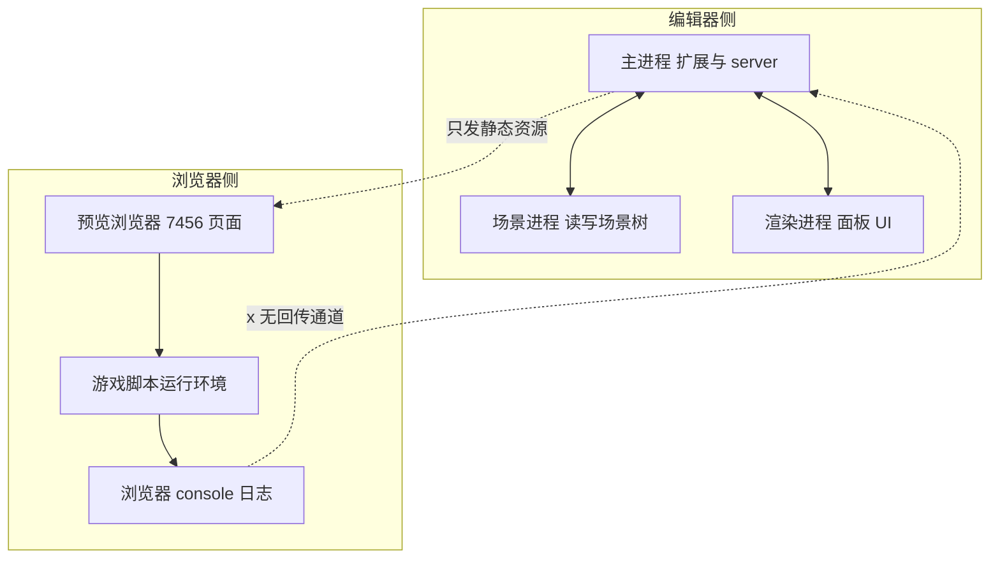
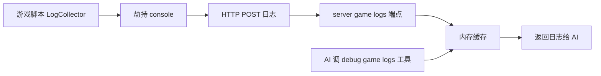

# 获取浏览器预览中的游戏运行日志：问题分析与方案对比

> 关联：cocos-mcp-server（Cocos Creator 3.7.3 编辑器扩展，内嵌 MCP HTTP server，端口 3001）
> 目标：让 AI 通过 MCP 工具，拿到"游戏在浏览器预览（7456）运行时的 console.log / 报错"

---

## 一、问题陈述

游戏在浏览器（7456）里跑，`console.log` / 报错都输出到**浏览器的 DevTools 控制台**，这些数据归浏览器进程所有。

`cocos-mcp-server` 跑在**编辑器主进程**。AI 客户端通过 MCP 调工具 → server → `Editor.Message` → 编辑器进程。**server 和浏览器之间没有任何运行时数据通道**，所以拿不到游戏日志。

现状结论：**拿不到**。下文拆根因，并给出 3 条可行路径的优缺点对比。

---

## 二、根因分析：为什么拿不到

### 2.1 进程模型——编辑器和预览浏览器是两个世界

Cocos Creator 是多进程架构，但要害在于：**预览浏览器根本不在这个架构里**，它是一个独立的 HTTP 客户端。

- 编辑器内部进程（主 / scene / panel）通过 **Editor.Message** 互通，server 挂在**主进程**。
- 预览浏览器是编辑器拉起的**独立 HTTP 客户端**，加载页面后游戏代码跑在**它自己的 JS 引擎**里，`console.log` / `error` 全部落进**浏览器的 console**，归浏览器进程所有。
- 编辑器的"控制台"面板只收**编辑器自身进程**的日志——游戏预览的 log 压根不经过编辑器，所以面板看不到，server 更不可能拿到。

### 2.2 Editor.Message 的边界——到不了浏览器

`Editor.Message` 的两个端点**必须都是注册了消息系统的 Cocos Creator 进程**。浏览器只是个吃 HTML/JS 的 HTTP 客户端，它：
- 不会发 `Editor.Message`
- 也不监听 `Editor.Message`

`preview` 消息模块只有 `query-preview-url`（查 URL）、`generate-settings` 这类**控制和查询**消息，**没有任何"把浏览器里的数据取回来"的消息**。

### 2.3 单向通道——只有下行，没有上行

编辑器 → 浏览器：**单向发静态资源**（HTML / JS / 资源）。
浏览器 → 编辑器：**没有任何反向数据流**。

日志是**运行时**产生的，自然回不来。这是"拿不到"的本质。

### 2.4 enableDebugger / vConsole 为什么也不算"拿到"

vConsole 是注入到**预览页面里**的浮窗组件，它捕获的依然是浏览器 console，**捕获完还是留在浏览器进程**（只是让你能在浏览器里翻看）。它没有、也不会把日志传回编辑器主进程。所以对 server 而言**毫无帮助**——内容要出来，还得靠方案一或方案二。

---

## 三、类比理解

> 就像你打开一个网页，网页里 JS 报错了——这个错误只在你本地浏览器里，**网站服务器不知道**（除非它专门埋了上报逻辑）。
>
> 编辑器之于预览浏览器，就是那个"只负责发资源、不接收运行时反馈"的服务器。日志在"客户端"产生，而 server 站在"服务端"，中间没有上行通道。
>
> 再换一个类比：编辑器像一个**广播电台**，只管对着浏览器"发射信号"（发资源）；但电台没有"听众热线"——浏览器里发生了什么，电台收不到。要收到，要么让听众主动打电话进来（方案一），要么在听众家里装个官方监听设备（方案二）。

---

## 四、三个方案详解

### 方案一：游戏脚本转发（推荐）

**原理**：在游戏里挂一个 `LogCollector` 组件，启动时劫持 `console.log` / `warn` / `error`，把每条日志通过 `fetch` HTTP POST 到 server 新增的 `/game-logs` 端点；server 把日志缓存进内存（带时间戳、级别、堆栈），再新增一个 `debug_game_logs` 工具供 AI 查询。

**本质**：在浏览器和 server 之间**人工挖一条反向隧道**。

- **优点**
  - 完全可控，不依赖浏览器启动参数，3.7.3 当前环境可直接跑通
  - 用浏览器原生 `fetch`，无需引入第三方库
  - 日志格式自定义灵活（可加业务标签、过滤）
- **缺点**
  - 要改游戏代码（侵入式）
  - 只能拿到**经过 `console.*` 的日志**；未捕获的同步异常（如脚本加载失败、引擎底层报错）可能漏掉
  - 需要游戏在预览里实际运行才会产生日志，加载阶段早期错误可能来不及上报
- **工作量**：中。一个组件 + 一个 server 端点 + 一个查询工具，三处改动

### 方案二：CDP（Chrome DevTools Protocol）

**原理**：预览浏览器以 `--remote-debugging-port` 启动，cocos-mcp-server 用 CDP 客户端连接，订阅 `Runtime.consoleAPICalled` 事件，直接拿到浏览器 console 的全部输出（含调用栈、级别）。`Log.entryAdded` 还能拿到浏览器自身的报错（网络、资源加载失败等）。

**本质**：用浏览器**官方提供的监控后门**，从外部读取 console。

- **优点**
  - **不改游戏代码**，零侵入
  - 原生支持**堆栈、级别**，能拿到游戏 console + 浏览器自身报错（网络/资源失败）
  - 能力最强，符合工业级方案
- **缺点**
  - 要配置浏览器调试端口——Cocos Creator 内置预览浏览器的启动参数不一定好改，可能需要让用户用外部 Chrome 连预览 URL
  - 要在 server 引入 CDP 客户端依赖（如 `chrome-remote-interface`）
  - 调试端口暴露有安全考量（本地开发无所谓，但要注意别开到公网）
  - 3.7.3 内置预览浏览器是否支持 remote debugging 需实测验证
- **工作量**：大。CDP 客户端集成 + 浏览器启动方式调整 + 事件订阅解析

### 方案三：vConsole

**原理**：预览开启 `enableDebugger` 注入 vConsole 浮窗，在浏览器页面内查看 console。

**本质**：只是浏览器页面内的可视化浮窗，**不打通任何反向通道**。

- **优点**
  - 接入成本最低，Cocos 预览自带开关
  - 人工调试时方便（在浏览器里翻日志）
- **缺点**
  - **日志仍留在浏览器进程，server 拿不到**——单独使用不解决问题
  - 必须配合方案一或方案二才能把内容取出来
- **工作量**：小，但**不解决核心问题**

---

## 五、优缺点对比总表

| 维度 | 方案一 游戏脚本转发 | 方案二 CDP | 方案三 vConsole |
|------|---------------------|------------|-----------------|
| 能否让 server 拿到日志 | 能 | 能 | 不能（仅页面内） |
| 是否改游戏代码 | 是（侵入式） | 否（零侵入） | 需注入开关 |
| 依赖浏览器特殊配置 | 否 | 是（调试端口） | 否 |
| 引入新依赖 | 否（用 fetch） | 是（CDP 客户端） | 是（vConsole 库） |
| 能拿到调用堆栈 | 需手动处理 | 原生支持 | 页面内显示 |
| 覆盖加载早期错误 | 弱（可能漏） | 强 | 弱 |
| 覆盖浏览器自身报错 | 否 | 是 | 部分 |
| 3.7.3 当前环境可行性 | 高 | 中（需实测） | 高 |
| 工作量 | 中 | 大 | 小但无效 |
| 综合推荐 | 推荐 | 备选（能力最强） | 不单独使用 |

---

## 六、推荐结论（已实测确定）

**选定：方案二的成熟实现 —— chrome-devtools-mcp（零开发）。** 理由：
- **零开发**：cocos-mcp-server 一行不改，仅配 `.mcp.json`
- **能力最强**：不止日志，还有网络、截图、性能、JS 执行、Source Map 堆栈
- **已实测全绿**（见第七节）

方案一（游戏脚本转发）**不采用**——chrome-devtools-mcp 零开发就覆盖全部诉求且更强，没必要自建日志通道。方案三（vConsole）仅作人工调试辅助。

> 注：原对比表里"方案二 CDP"的"工作量：大 / 需引入 CDP 客户端"是指**自己从零接 CDP**；改用成熟的 chrome-devtools-mcp 后，这部分工作量降为零，缺点里的"调试端口配置 / CDP 依赖"也由它内部消化了。

## 七、实测验证与排查插曲（重要）

### 7.1 验证结果（2026-07-30，全绿）
- chrome-devtools-mcp **v1.6.0** 启动 + MCP initialize 握手成功
- 暴露 **29 个工具**（list_console_messages / take_screenshot / evaluate_script / list_network_requests / performance 等）
- `navigate_page` 到 7456 成功，引擎完整加载（`window.cc` = object，`Cocos Creator v3.7.3` 日志出现）
- `list_console_messages` 成功读到游戏完整初始化日志
- 配置：`CocosMCP/.mcp.json` 增加 `chrome-devtools`（npx 启动）

### 7.2 排查插曲：cce:/ CORS 是编译产物损坏的假象
验证途中，外部 Chrome 连 7456 一度刷出大量 `cce:/internal/...` 被 CORS 拦截、`window.cc` 为 undefined，**曾误判为"cce:/ 是内置浏览器专用协议、外部 Chrome 不兼容"**。

**真根因**：`temp/programming/packer-driver/targets/preview/chunks/86/` 脚本编译产物缺失——import map 引用了它，但文件不存在，SystemJS 加载链断裂，连锁触发协议级错误。

**修复**：关闭 Cocos Creator → 删除 `temp/programming` → 重开编辑器触发重新编译 → 预览恢复正常（`window.cc` = object，CORS 消失）。

**教训**：`cce:/` 协议本身在标准 Chrome 能正常工作（靠 import map 映射成 http 路径），CORS 只是编译产物不完整的**症状**而非根因。以后遇到 `cce:/internal` CORS，**先查 `temp/programming` 是否完整**，别误判为协议不兼容。

---

## 八、引用说明

本文根因分析与方案选型参考了以下资料：

- Chrome DevTools Protocol 官方规范（CDP 方案基础）：
  https://chromedevtools.github.io/devtools-protocol/
- CDP `Runtime.consoleAPICalled` 事件（订阅浏览器 console）：
  https://chromedevtools.github.io/devtools-protocol/tot/Runtime/#event-consoleAPICalled
- vConsole 项目（腾讯，页面内日志浮窗）：
  https://github.com/Tencent/vConsole
- Cocos Creator 预览与调试（预览服务、enableDebugger）：
  https://docs.cocos.com/creator/manual/zh/editor/preview/
- Cocos Creator 扩展消息系统（Editor.Message 边界）：
  https://docs.cocos.com/creator/manual/zh/editor/extension/messages/
- Model Context Protocol 官方（MCP 工具定义规范）：
  https://modelcontextprotocol.io/

> 注：Cocos 官方文档 URL 以实际版本（3.7.3 / 3.8.x）目录为准，链接为通用入口。
