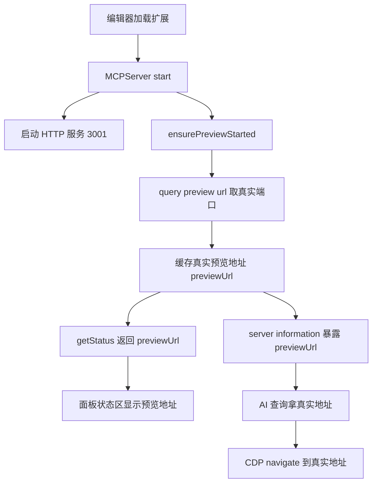

# Cocos 预览端口动态化方案（多工程 7456 冲突修复）

> 解决多工程同时打开时，Cocos 预览端口从 7456 自动递增（7457、7458），导致浏览器调试三件套 skill（cocos-preview-scene / cocos-browser-logs / cocos-browser-eval）里写死的 7456 全部失效、CDP navigate 打不开页面的问题。做法是**端口彻底动态化**：MCP server 启动时查询并缓存真实预览地址，面板状态区显示，AI 通过 server_information 或 run(openBrowser=false) 动态获取，skill 内不再出现任何写死的端口号。

## 一、问题背景

浏览器调试三件套 skill 是一套联动设计，全部依赖"预览端口恒为 7456"这个假设：

| skill | 作用 | 写死 7456 处数 |
|-------|------|---------------|
| cocos-preview-scene | 开预览（单 CDP 窗口） | 约 17 处 |
| cocos-browser-logs | 读游戏控制台日志 | 约 11 处 |
| cocos-browser-eval | 在预览页跑 JS | 约 13 处 |

多工程同时打开时，Cocos Creator 会把第二个工程的预览端口自动递增（7456 → 7457 → 7458），三件套里所有 `http://localhost:7456` 全部对不上，CDP navigate 到 7456 直接打不开，读日志、跑 JS、开预览全废。

## 二、关键认知：两个端口不能混为一谈

| | MCP 端口（默认 3001） | 预览端口（默认 7456/7457…） |
|---|---|---|
| 归属 | cocos-mcp 扩展自己的 HTTP 服务 | Cocos 编辑器的游戏预览服务 |
| 多工程表现 | 每个工程 settings 里固定 | **会自动递增冲突** |
| 能否生成时渲染写死 | 能（现有 13 份工具 skill 的 `{{port}}` 占位符就是这么做的） | **不能**——生成时填的端口，下次多开工程就过期 |

所以预览端口的正解不是"生成 skill 时把端口渲染进去"（那只是把写死 7456 换成写死 7457，照样过期），而是 **skill 里根本不出现具体端口号**，运行时动态查询。模板里没有端口占位符 → 生成安装无需渲染 → 运行时实时查 → 永远正确。

## 三、整体方案（端口动态化闭环）

四个环节联动：
1. **后端启动起预览**：MCPServer.start() 时内联 `preview:query-preview-url`（等价于 start-preview.js 的逻辑，但不 spawn 脚本），把真实地址缓存到 previewUrl。
2. **后端暴露**：getStatus() 返回 previewUrl（供面板），server_information(get_comprehensive_status) 也返回 previewUrl（供 AI）。
3. **前端显示**：服务器状态区"状态/连接数"旁加一行"预览地址"。
4. **skill 动态化**：三件套改成"先查真实预览地址，后续 navigate/eval/logs 全用它"，不写死端口。

## 四、改动清单

### 后端
| 文件 | 改动 |
|------|------|
| `source/types/index.ts` | ServerStatus 加 `previewUrl?: string` |
| `source/mcp-server.ts` | 加 previewUrl 字段 + ensurePreviewStarted()（query-preview-url 并缓存成 localhost）+ start() 末尾异步调用 + getStatus() 返回 previewUrl + 类头流程注释 |
| `source/tools/server-tools.ts` | getServerStatus() 用 Promise.allSettled 并发查 query-preview-url，结果规范成 localhost 放进 status.previewUrl；server_information 的 get_comprehensive_status 描述补"preview URL" |

### 前端
| 文件 | 改动 |
|------|------|
| `static/template/vue/mcp-server-app.html` | server-status section 加一行"预览地址"（serverRunning 时显示 previewUrl） |
| `source/panels/default/index.ts` | previewUrl ref + 2 秒轮询取 result.previewUrl + return 暴露 + i18n 加 preview_url / preview_not_ready 中英文案 |

### skill（源头 SkillCustomers + 产物 CocosMCP/.claude/skills 各一份）
| skill | 改动 |
|-------|------|
| cocos-preview-scene | 新增步骤 1"取真实预览地址"；所有 7456 改为动态地址；信仰从"绝不调 run"改为"server_information 查 previewUrl 为主，run openBrowser=false 兜底" |
| cocos-browser-logs | 步骤 1 取动态地址；判断已有页面、navigate、示例全用动态端口 |
| cocos-browser-eval | 自检模板去掉 indexOf('7456')，改用 typeof window.cc；补齐缺失的 SkillCustomers 源头 |

## 五、AI 拿预览地址的两条路

1. **首选**：`server_server_information`(action=get_comprehensive_status) → 返回里的 `previewUrl` 字段。
   - 纯查询、无副作用、不触发 run。
   - `action` 是**必选参数**（enum），AI 旧 schema 缓存里这个 action 一直存在，不受 schema 缓存影响。
   - previewUrl 是返回字段（输出），AI 一定能读到。
2. **兜底**：`project_project_manage`(action=run, platform=browser, openBrowser=false) → 返回 `data.url`。
   - run 内部本就调 query-preview-url，返回真实端口的 localhost 地址。
   - openBrowser=false 不弹系统浏览器（实测验证过）。
   - 仅当 previewUrl 为空（MCP server 刚启动、预览尚未就绪）时才用。

> 两条路都不弹系统浏览器，CDP 专用 Chrome 始终是唯一窗口。原 skill 信仰"绝不调 run"是因为 run 默认 openBrowser=true 弹系统浏览器致双窗口；现在 openBrowser=false 已解决，且 server_information 主路径连 run 都不用。

## 六、验证方法

1. `cd cocos-mcp-server && npm run build` —— tsc 无报错（已通过）。
2. 完全退出并重启 Cocos Creator（刷新扩展不够，见项目记忆 cocos-mcp-server-rebuild-restart）。
3. 打开 Cocos MCP 面板 → 服务器 Tab，启动服务器后，状态区出现"预览地址"一行（如 http://localhost:7456）。
4. 多工程验证：再开一个 Cocos 工程，第二个工程面板显示的预览地址应为 7457 等递增端口。
5. AI 验证：调 server_information(get_comprehensive_status)，确认返回含正确的 previewUrl。
6. skill 验证：让 AI 跑预览/读日志/eval，确认它动态取地址、navigate 成功，不再依赖写死的 7456。

## 七、类比理解

Cocos 预览端口像**门牌号**。一个城市里（一台机器）开多家分店（多个工程），第二家不能用同样的门牌 7456，市政自动分配 7457。

- **写死 7456** = 给快递员（CDP）的派件单上印死门牌 7456。分店换到 7457 时，快递员按单子去 7456 扑空。
- **动态查询** = 派件前先打电话问"你今天门牌是多少"（server_information 查 previewUrl），拿到 7457 再送。无论分店怎么搬，永远送对。

MCP 端口 3001 则是**总机号码**，每个分店自己定的、固定不变的，可以印在名片上（生成 skill 时渲染写死）。两类号码性质不同，处理方式也不同。

## 八、注意事项

- 改了 cocos-mcp-server 源码，必须 `npm run build` + **完全重启 Cocos Creator**（刷新扩展无效）。
- AI 侧若发现 run 仍弹了系统浏览器（openBrowser 因 MCP schema 缓存没传出去，退回默认 true），关掉系统浏览器窗口即可；重启一次 Claude Code 会话可刷新 schema，让 openBrowser=false 稳定生效。
- Cocos 预览服务由编辑器常驻，cocos-mcp 启动时已查询确认在跑并缓存地址；编辑器刚加载时预览可能尚未就绪，面板 2 秒轮询会自动补上。
- 三份 skill 现已纳入"生成+安装"流程：源头在 `cocos-mcp-server/CodeAgents/SkillCustomers/`，面板"安装到选中平台"会把它们和 13 份自动生成的一起部署到项目 `.claude/skills`。

## 九、参考引用

- Cocos Creator preview 消息：`preview:query-preview-url`（返回当前编辑器预览服务地址，多工程时为本工程真实端口）
- 项目记忆 [[preview-use-browser-platform]] / [[preview-url-use-localhost]] / [[preview-no-run-single-cdp]] / [[cocos-mcp-server-rebuild-restart]]
- 三件套 skill 源头：`cocos-mcp-server/CodeAgents/SkillCustomers/cocos-preview-scene|cocos-browser-logs|cocos-browser-eval`
- 独立命令行工具：`cocos-mcp-server/scripts/start-preview.js`（手动触发 run openBrowser=false，零依赖）
- chrome-devtools-mcp：`navigate_page` / `evaluate_script` / `list_console_messages`
- Model Context Protocol：https://modelcontextprotocol.io/
